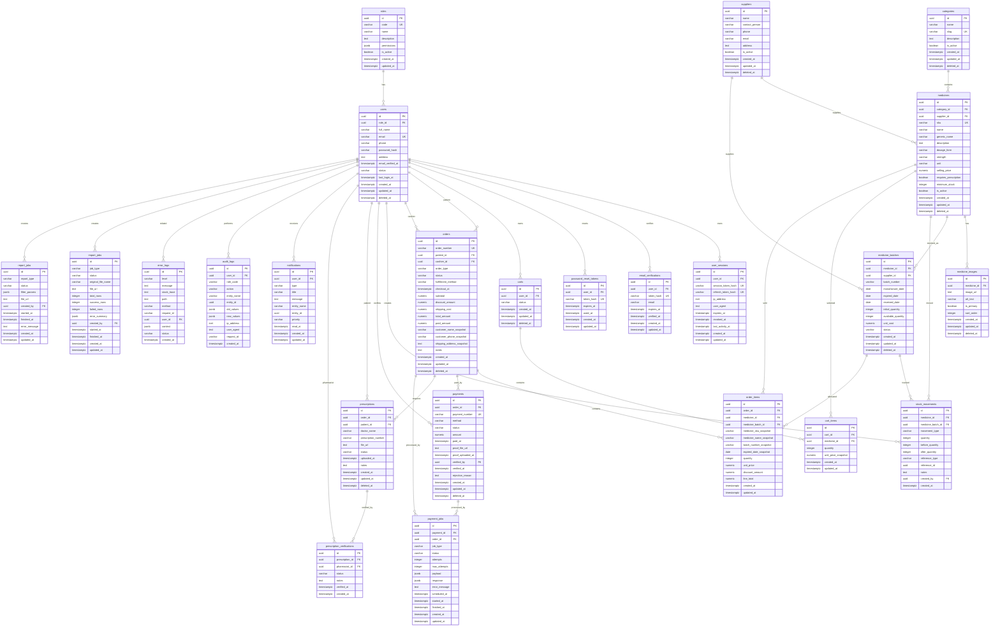

# ERD Database - Klinik Makmur Jaya

```mermaid
erDiagram
    roles ||--o{ users : has
    users ||--o{ user_sessions : owns
    users ||--o{ email_verifications : verifies
    users ||--o{ password_reset_tokens : resets
    users ||--o{ carts : owns
    users ||--o{ orders : patient
    users ||--o{ orders : cashier
    users ||--o{ stock_movements : creates
    users ||--o{ payments : verifies
    users ||--o{ prescriptions : patient
    users ||--o{ prescription_verifications : pharmacist
    users ||--o{ notifications : receives
    users ||--o{ audit_logs : performs
    users ||--o{ error_logs : related
    users ||--o{ import_jobs : creates
    users ||--o{ report_jobs : creates

    categories ||--o{ medicines : contains
    suppliers ||--o{ medicines : supplies
    suppliers ||--o{ medicine_batches : supplies
    medicines ||--o{ medicine_images : has
    medicines ||--o{ medicine_batches : stocked_as
    medicines ||--o{ stock_movements : moved
    medicines ||--o{ cart_items : selected
    medicines ||--o{ order_items : sold
    medicine_batches ||--o{ stock_movements : tracked
    medicine_batches ||--o{ order_items : allocated

    carts ||--o{ cart_items : contains
    orders ||--o{ order_items : contains
    orders ||--o{ payments : paid_by
    orders ||--o{ prescriptions : requires
    orders ||--o{ payment_jobs : processed_by
    payments ||--o{ payment_jobs : processed_by
    prescriptions ||--o{ prescription_verifications : verified_by

    roles {
        uuid id PK
        varchar code UK
        varchar name
        text description
        jsonb permissions
        boolean is_active
        timestamptz created_at
        timestamptz updated_at
    }

    users {
        uuid id PK
        uuid role_id FK
        varchar full_name
        varchar email UK
        varchar phone
        varchar password_hash
        text address
        timestamptz email_verified_at
        varchar status
        timestamptz last_login_at
        timestamptz created_at
        timestamptz updated_at
        timestamptz deleted_at
    }

    user_sessions {
        uuid id PK
        uuid user_id FK
        varchar session_token_hash UK
        varchar refresh_token_hash UK
        inet ip_address
        text user_agent
        timestamptz expires_at
        timestamptz revoked_at
        timestamptz last_activity_at
        timestamptz created_at
        timestamptz updated_at
    }

    email_verifications {
        uuid id PK
        uuid user_id FK
        varchar token_hash UK
        varchar email
        timestamptz expires_at
        timestamptz verified_at
        timestamptz created_at
        timestamptz updated_at
    }

    password_reset_tokens {
        uuid id PK
        uuid user_id FK
        varchar token_hash UK
        timestamptz expires_at
        timestamptz used_at
        timestamptz created_at
        timestamptz updated_at
    }

    categories {
        uuid id PK
        varchar name
        varchar slug UK
        text description
        boolean is_active
        timestamptz created_at
        timestamptz updated_at
        timestamptz deleted_at
    }

    suppliers {
        uuid id PK
        varchar name
        varchar contact_person
        varchar phone
        varchar email
        text address
        boolean is_active
        timestamptz created_at
        timestamptz updated_at
        timestamptz deleted_at
    }

    medicines {
        uuid id PK
        uuid category_id FK
        uuid supplier_id FK
        varchar sku UK
        varchar name
        varchar generic_name
        text description
        varchar dosage_form
        varchar strength
        varchar unit
        numeric selling_price
        boolean requires_prescription
        integer minimum_stock
        boolean is_active
        timestamptz created_at
        timestamptz updated_at
        timestamptz deleted_at
    }

    medicine_images {
        uuid id PK
        uuid medicine_id FK
        text image_url
        varchar alt_text
        boolean is_primary
        integer sort_order
        timestamptz created_at
        timestamptz updated_at
        timestamptz deleted_at
    }

    medicine_batches {
        uuid id PK
        uuid medicine_id FK
        uuid supplier_id FK
        varchar batch_number
        date manufacture_date
        date expired_date
        date received_date
        integer initial_quantity
        integer available_quantity
        numeric unit_cost
        varchar status
        timestamptz created_at
        timestamptz updated_at
        timestamptz deleted_at
    }

    stock_movements {
        uuid id PK
        uuid medicine_id FK
        uuid medicine_batch_id FK
        varchar movement_type
        integer quantity
        integer before_quantity
        integer after_quantity
        varchar reference_type
        uuid reference_id
        text notes
        uuid created_by FK
        timestamptz created_at
    }

    carts {
        uuid id PK
        uuid user_id FK
        varchar status
        timestamptz created_at
        timestamptz updated_at
        timestamptz deleted_at
    }

    cart_items {
        uuid id PK
        uuid cart_id FK
        uuid medicine_id FK
        integer quantity
        numeric unit_price_snapshot
        timestamptz created_at
        timestamptz updated_at
    }

    orders {
        uuid id PK
        varchar order_number UK
        uuid patient_id FK
        uuid cashier_id FK
        varchar order_type
        varchar status
        varchar fulfillment_method
        timestamptz checkout_at
        numeric subtotal
        numeric discount_amount
        numeric shipping_cost
        numeric total_amount
        numeric paid_amount
        varchar customer_name_snapshot
        varchar customer_phone_snapshot
        text shipping_address_snapshot
        text notes
        timestamptz created_at
        timestamptz updated_at
        timestamptz deleted_at
    }

    order_items {
        uuid id PK
        uuid order_id FK
        uuid medicine_id FK
        uuid medicine_batch_id FK
        varchar medicine_sku_snapshot
        varchar medicine_name_snapshot
        varchar batch_number_snapshot
        date expired_date_snapshot
        integer quantity
        numeric unit_price
        numeric discount_amount
        numeric line_total
        timestamptz created_at
        timestamptz updated_at
    }

    payments {
        uuid id PK
        uuid order_id FK
        varchar payment_number UK
        varchar method
        varchar status
        numeric amount
        timestamptz paid_at
        text proof_file_url
        timestamptz proof_uploaded_at
        uuid verified_by FK
        timestamptz verified_at
        text rejection_reason
        timestamptz created_at
        timestamptz updated_at
        timestamptz deleted_at
    }

    prescriptions {
        uuid id PK
        uuid order_id FK
        uuid patient_id FK
        varchar doctor_name
        varchar prescription_number
        text file_url
        varchar status
        timestamptz uploaded_at
        text notes
        timestamptz created_at
        timestamptz updated_at
        timestamptz deleted_at
    }

    prescription_verifications {
        uuid id PK
        uuid prescription_id FK
        uuid pharmacist_id FK
        varchar status
        text notes
        timestamptz verified_at
        timestamptz created_at
    }

    notifications {
        uuid id PK
        uuid user_id FK
        varchar type
        varchar title
        text message
        varchar entity_name
        uuid entity_id
        varchar priority
        timestamptz read_at
        timestamptz created_at
        timestamptz updated_at
    }

    audit_logs {
        uuid id PK
        uuid user_id FK
        varchar role_code
        varchar action
        varchar entity_name
        uuid entity_id
        jsonb old_values
        jsonb new_values
        inet ip_address
        text user_agent
        varchar request_id
        timestamptz created_at
    }

    error_logs {
        uuid id PK
        varchar level
        text message
        text stack_trace
        text path
        varchar method
        varchar request_id
        uuid user_id FK
        jsonb context
        varchar status
        timestamptz created_at
    }

    import_jobs {
        uuid id PK
        varchar job_type
        varchar status
        varchar original_file_name
        text file_url
        integer total_rows
        integer success_rows
        integer failed_rows
        jsonb error_summary
        uuid created_by FK
        timestamptz started_at
        timestamptz finished_at
        timestamptz created_at
        timestamptz updated_at
    }

    report_jobs {
        uuid id PK
        varchar report_type
        varchar status
        jsonb filter_params
        text file_url
        uuid created_by FK
        timestamptz started_at
        timestamptz finished_at
        text error_message
        timestamptz created_at
        timestamptz updated_at
    }

    payment_jobs {
        uuid id PK
        uuid payment_id FK
        uuid order_id FK
        varchar job_type
        varchar status
        integer attempts
        integer max_attempts
        jsonb payload
        jsonb response
        text error_message
        timestamptz scheduled_at
        timestamptz started_at
        timestamptz finished_at
        timestamptz created_at
        timestamptz updated_at
    }
```
