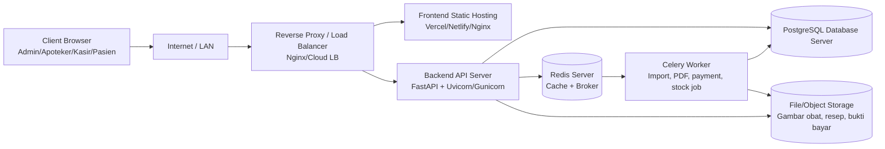

# Dokumentasi BNSP Sistem E-Commerce Penjualan Obat Klinik Makmur Jaya

Dokumen ini merangkum lingkup teknis, manajemen proyek, keamanan, kualitas, operasional, dan use case role untuk Sistem E-Commerce Penjualan Obat Klinik Makmur Jaya. Sistem terdiri dari frontend React/Vite/Tailwind dan backend FastAPI dengan PostgreSQL, Redis, background job, JWT authentication, audit log, error log, report, import data, dan monitoring.

## 1. Arsitektur Perangkat Keras

### Topologi



### Spesifikasi Minimum Server

| Komponen | Minimum | Rekomendasi Produksi |
|---|---:|---:|
| Web/API server | 2 vCPU, RAM 2 GB | 4 vCPU, RAM 8 GB |
| Database PostgreSQL | 2 vCPU, RAM 4 GB, SSD 50 GB | 4 vCPU, RAM 16 GB, SSD 200 GB |
| Redis server | 1 vCPU, RAM 1 GB | 2 vCPU, RAM 4 GB |
| Storage file | 20 GB | Object storage/S3-compatible + backup |
| Bandwidth | 10 Mbps | 50 Mbps atau sesuai trafik |
| Backup | harian | harian + retention 7/30/90 hari |

## 2. Project Integration Management

### Project Charter

| Item | Deskripsi |
|---|---|
| Nama proyek | Sistem E-Commerce Penjualan Obat Klinik Makmur Jaya |
| Sponsor | Manajemen Klinik Makmur Jaya |
| Tujuan | Digitalisasi katalog obat, transaksi online/offline, verifikasi resep, stok, laporan, dan monitoring operasional |
| Scope utama | Web app multi-role: Admin, Apoteker, Kasir, Pasien |
| Keberhasilan | Role berjalan sesuai hak akses, transaksi dan stok terintegrasi, audit/error log tersedia, laporan dapat dibuat |

### Stakeholder

| Stakeholder | Kepentingan |
|---|---|
| Pemilik klinik | Kontrol penjualan, laporan, kepatuhan |
| Admin | Master data, transaksi, laporan, sistem |
| Apoteker | Verifikasi resep, stok, kadaluarsa |
| Kasir | POS offline, checkout, riwayat |
| Pasien | Katalog, cart, checkout pickup-only, resep, status pesanan |
| Tim IT | Deployment, monitoring, backup, keamanan |

### Timeline Ringkas

| Fase | Durasi | Deliverable |
|---|---:|---|
| Inisiasi | 1 minggu | Charter, scope, risiko awal |
| Analisis | 1 minggu | Use case, ERD, API contract |
| Implementasi | 3-4 minggu | Backend, frontend, integrasi |
| Testing | 1-2 minggu | Unit/API test, UAT, bug fix |
| Deploy | 1 minggu | Cutover, monitoring, user guide |

### Integrasi Antar Modul

| Modul | Integrasi |
|---|---|
| Auth | JWT untuk semua protected request |
| Medicine | Katalog, cart, stok, laporan, import |
| Cart/Checkout | Medicine, stock validation, order, payment |
| Prescription | Order pasien, validasi apoteker/admin |
| Stock | Medicine batch, checkout FIFO, alert |
| Report | Order, payment, medicine, stock |
| Notification | Stok kritis, pesanan, error |
| Audit/Error Log | Semua aktivitas penting dan exception |

## 3. Project Scope Management

### In-Scope

- Registrasi/login/logout/verify email/refresh token.
- Role-based dashboard dan menu.
- CRUD obat, kategori, supplier, pelanggan.
- Katalog, detail obat, cart, checkout online pickup-only.
- POS kasir dan checkout offline.
- Upload resep, verifikasi/reject resep.
- Upload bukti pembayaran dan verifikasi manual admin.
- Stok, batch, adjustment, stok kritis, kadaluarsa.
- Laporan penjualan, revenue, best-selling, PDF.
- Import CSV/Excel obat.
- Notification, audit log, error log.
- Monitoring health/resource/database/Redis.

### Out-of-Scope

- Telemedicine/konsultasi dokter live.
- Payment gateway produksi penuh.
- Integrasi BPJS/asuransi.
- Mobile app native.
- E-prescription dari rumah sakit eksternal.
- Warehouse multi-cabang kompleks.

### WBS Sederhana

```text
1. Manajemen Proyek
   1.1 Charter
   1.2 Scope
   1.3 Timeline
2. Backend
   2.1 Auth & role
   2.2 Master data
   2.3 Cart/order/payment
   2.4 Prescription
   2.5 Stock
   2.6 Report/import/job
   2.7 Log/monitoring
3. Frontend
   3.1 Auth pages
   3.2 Role dashboard
   3.3 Admin pages
   3.4 Apoteker pages
   3.5 Kasir POS
   3.6 Pasien commerce
4. Testing
   4.1 API test
   4.2 FE flow test
   4.3 UAT role
5. Deployment
   5.1 Environment
   5.2 Migration DB
   5.3 Cutover
   5.4 Monitoring
```

## 4. Project Quality Management

### Standar Kualitas

- Backend memakai validation schema Pydantic.
- Query database memakai SQLAlchemy ORM atau SQL parameterized.
- Frontend tidak hardcode API URL, memakai `VITE_API_BASE_URL`.
- Protected request memakai `Authorization: Bearer <token>`.
- Role access diproteksi di frontend dan backend.
- Error ditangkap dan dicatat ke error log.
- Perubahan data penting dicatat ke audit log.

### Quality Checklist

| Area | Checklist |
|---|---|
| Code review | Naming konsisten, tidak ada secret, tidak ada hardcode localhost di source |
| API | Status code benar, validation error jelas, auth/role aktif |
| FE | Route role benar, loading/error state ada, tidak render object mentah |
| Security | JWT, bcrypt, CORS, input validation |
| Data | Migration Alembic berjalan, seed data aman |
| Observability | Audit log, error log, monitoring endpoint |

### Testing, UAT, Acceptance Criteria

- Unit/API test untuk service kritis.
- Manual UAT per role.
- Acceptance criteria: semua use case in-scope dapat dijalankan lokal dan protected endpoint membutuhkan token valid.

## 5. Risiko Keamanan Informasi

| Risiko | Dampak | Mitigasi |
|---|---|---|
| SQL Injection | Data bocor/diubah | SQLAlchemy ORM, parameterized query, validasi Pydantic |
| XSS | Token/user data dicuri | React escaping, sanitasi input rich text, CSP saat deploy |
| CSRF | Request tidak sah | JWT Bearer di header, SameSite jika memakai cookie |
| Brute force login | Akun diambil alih | Rate limit, lockout, audit login gagal |
| Kebocoran data pasien | Pelanggaran privasi | Role access, minimal exposure, HTTPS, audit log |
| Kesalahan resep | Risiko medis | Verifikasi apoteker, catatan, status approval/rejection |
| Kehilangan transaksi | Kerugian finansial | DB transaction, backup, audit log, idempotency untuk payment |
| File upload berbahaya | Malware/defacement | Validasi ekstensi, storage terpisah, scan file, URL whitelist |

## 6. Analisis Tools

| Tool | Alasan |
|---|---|
| React | UI component-based, cocok dashboard multi-role |
| Vite | Dev server cepat dan build modern |
| Tailwind | Styling konsisten dan cepat untuk dashboard |
| FastAPI | API cepat, OpenAPI otomatis, Pydantic validation |
| PostgreSQL | Relational DB kuat untuk transaksi farmasi |
| SQLAlchemy | ORM dan query aman |
| Alembic | Versioning migration DB |
| JWT | Stateless auth untuk FE-BE |
| bcrypt | Hash password aman |
| ReportLab/WeasyPrint | Generate laporan PDF |
| Recharts | Chart laporan di frontend |
| Pandas | Parsing/validasi data import |
| OpenPyXL | Baca file Excel |
| Celery | Background job paralel |
| Redis | Broker Celery, cache, notification support |

## 7. Skalabilitas Perangkat Lunak

- Horizontal scaling: tambah instance FastAPI di belakang load balancer.
- Database indexing: index `orders.created_at`, `medicines.name`, `medicines.sku`, `stocks.expired_date`, `audit_logs.created_at`.
- Pagination: endpoint list memakai `page` dan `page_size`.
- Redis caching: cache katalog, dashboard summary, report ringan.
- Background job: import CSV/Excel, PDF besar, payment processing, stock update.
- Load balancer: Nginx/Cloud LB untuk API.
- Pemisahan service: auth/order/report/notification dapat dipisah saat traffic naik.

## 8. Identifikasi Library/Framework

| Library | Versi di project | Lisensi umum | Fungsi | Alasan |
|---|---:|---|---|---|
| React | 18.3.1 | MIT | UI | Ekosistem stabil |
| Vite | 6.0.5 | MIT | Build/dev server | Cepat |
| Tailwind CSS | 3.4.17 | MIT | Styling | Konsisten |
| Axios | 1.7.9 | MIT | HTTP client | Interceptor JWT |
| React Router DOM | 7.1.1 | MIT | Routing | Role-based route |
| React Icons | 5.4.0 | MIT | Icon UI | Konsisten |
| React Toastify | 11.0.2 | MIT | Toast | Feedback aksi |
| Recharts | 2.15.0 | MIT | Chart | Laporan |
| FastAPI | sesuai requirements | MIT | API | OpenAPI & validation |
| SQLAlchemy | sesuai requirements | MIT | ORM | Query aman |
| Alembic | sesuai requirements | MIT | Migration | DB versioning |
| passlib/bcrypt | sesuai requirements | BSD/Apache | Password hash | Security |
| Celery | sesuai requirements | BSD | Job async | Parallel processing |
| Redis client | sesuai requirements | MIT | Broker/cache | Scalability |
| Pandas | sesuai requirements | BSD | Import data | CSV/Excel processing |
| OpenPyXL | sesuai requirements | MIT | Excel parser | Import XLSX |

## 9. SQL

```sql
-- Laporan penjualan per hari
SELECT DATE(checkout_at) AS tanggal,
       COUNT(*) AS total_transaksi,
       SUM(total_amount) AS total_penjualan
FROM orders
WHERE checkout_at BETWEEN :start_date AND :end_date
GROUP BY DATE(checkout_at)
ORDER BY tanggal;

-- Stok kritis
SELECT m.id, m.sku, m.name, m.minimum_stock,
       COALESCE(SUM(b.current_quantity), 0) AS current_stock
FROM medicines m
LEFT JOIN medicine_batches b ON b.medicine_id = m.id
WHERE m.is_active = TRUE
GROUP BY m.id
HAVING COALESCE(SUM(b.current_quantity), 0) <= m.minimum_stock;

-- Obat terlaris
SELECT oi.medicine_id, oi.medicine_name_snapshot,
       SUM(oi.quantity) AS total_terjual,
       SUM(oi.line_total) AS total_revenue
FROM order_items oi
JOIN orders o ON o.id = oi.order_id
WHERE o.checkout_at BETWEEN :start_date AND :end_date
GROUP BY oi.medicine_id, oi.medicine_name_snapshot
ORDER BY total_terjual DESC
LIMIT 10;

-- Obat mendekati kadaluarsa
SELECT m.name, b.batch_number, b.expired_date, b.current_quantity
FROM medicine_batches b
JOIN medicines m ON m.id = b.medicine_id
WHERE b.expired_date BETWEEN CURRENT_DATE AND CURRENT_DATE + INTERVAL '90 days'
  AND b.current_quantity > 0
ORDER BY b.expired_date ASC;

-- Rekap transaksi
SELECT order_type, status, fulfillment_method,
       COUNT(*) AS jumlah,
       SUM(total_amount) AS total
FROM orders
WHERE checkout_at BETWEEN :start_date AND :end_date
GROUP BY order_type, status, fulfillment_method;

-- Laporan pembayaran
SELECT method, status,
       COUNT(*) AS jumlah_pembayaran,
       SUM(amount) AS total_amount
FROM payments
WHERE created_at BETWEEN :start_date AND :end_date
GROUP BY method, status;
```

## 10. Algoritma Pemrograman

### FIFO Stok Berdasarkan Expired Date

```python
def allocate_stock_fifo(batches, requested_qty):
    allocations = []
    remaining = requested_qty
    for batch in sorted(batches, key=lambda b: b.expired_date):
        if batch.current_quantity <= 0:
            continue
        taken = min(batch.current_quantity, remaining)
        allocations.append({"batch_id": batch.id, "qty": taken})
        remaining -= taken
        if remaining == 0:
            break
    if remaining > 0:
        raise ValueError("Stok tidak cukup")
    return allocations
```

### Autocomplete Search

```python
def autocomplete(keyword, medicines):
    q = keyword.lower()
    return [m.name for m in medicines if m.name.lower().startswith(q)][:10]
```

### Fuzzy Search

```python
from difflib import SequenceMatcher

def fuzzy_search(keyword, medicines, threshold=0.6):
    q = keyword.lower()
    scored = []
    for medicine in medicines:
        score = SequenceMatcher(None, q, medicine.name.lower()).ratio()
        if score >= threshold or q in medicine.name.lower():
            scored.append((score, medicine))
    return [item for _, item in sorted(scored, reverse=True)]
```

### Perhitungan Total Cart

```python
def calculate_cart_total(items):
    subtotal = sum(item.quantity * item.unit_price_snapshot for item in items)
    service_cost = 0
    return subtotal + service_cost
```

### Validasi Stok Checkout

```python
def validate_checkout_stock(cart_items, stock_service):
    for item in cart_items:
        available = stock_service.available_stock(item.medicine_id)
        if available < item.quantity:
            raise ValueError(f"Stok {item.medicine_id} tidak cukup")
```

## 11. Migrasi Teknologi Baru

### Simulasi Migrasi Manual/Spreadsheet ke Sistem

| Spreadsheet lama | Field sistem | Validasi |
|---|---|---|
| Kode Obat | sku | unik, tidak kosong |
| Nama Obat | name | tidak kosong |
| Kategori | category_id | harus ada di master kategori |
| Supplier | supplier_id | opsional/harus ada jika diisi |
| Harga | selling_price | angka >= 0 |
| Stok | initial_quantity | integer > 0 |
| Expired | expired_date | tanggal valid dan belum lewat |

Strategi:
1. Backup spreadsheet lama.
2. Normalisasi nama kategori/supplier.
3. Import staging.
4. Validasi duplikasi SKU, harga, stok, expired date.
5. Import final lewat job `/imports/medicines`.
6. Audit hasil dan sampling data.

Rollback:
- Simpan backup database sebelum import.
- Catat `job_id`.
- Jika gagal, restore backup atau nonaktifkan record hasil import berdasarkan job batch.

## 12. Debugging

- Error handling API mengembalikan validation error yang jelas.
- Frontend menampilkan toast error.
- Error log dashboard membaca `/error-logs` dan resolve memakai `/error-logs/{id}/resolve`.
- Audit log membaca `/audit-logs`.

Contoh skenario:
| Skenario | Langkah debugging |
|---|---|
| Login gagal | Cek `/auth/login`, seed user, password hash, CORS |
| Checkout gagal | Cek cart item, stok batch, transaksi database |
| Upload resep gagal | Cek order_id valid dan role pasien |
| PDF gagal | Cek Celery worker, Redis, report job |

## 13. Real-Time Programming

Target real-time notification:
- Stok kritis.
- Pesanan baru.
- Status pesanan berubah.
- Error aplikasi critical.

Implementasi:
- Backend membuat notifikasi ke tabel notifications.
- Redis pub/sub atau WebSocket dipakai untuk push.
- Frontend fallback polling `/notifications`.
- Notification bell menampilkan jumlah unread.

## 14. Parallel Programming

Celery + Redis digunakan untuk:
- Import CSV/Excel obat.
- Generate laporan PDF besar.
- Proses pembayaran.
- Update stok batch besar.

Pola:
```text
FastAPI menerima request -> buat job record -> enqueue Celery -> worker proses -> update DB/job status -> frontend cek /jobs/{id}
```

## 15. Multimedia Programming

- Gambar obat: endpoint `/medicines/{id}/images` menyimpan `image_url`.
- Resep pasien: endpoint `/prescriptions/upload` menyimpan `file_url`.
- Bukti pembayaran: endpoint `/payments/{order_id}/upload-proof` menyimpan `proof_file_url`.
- Produksi disarankan memakai object storage dan validasi MIME type.

## 16. UAT

| Role | Skenario | Expected | Status | Catatan |
|---|---|---|---|---|
| Admin | Login | Masuk dashboard admin | Belum diuji |  |
| Admin | Kelola obat | Create/edit/delete obat berhasil | Belum diuji |  |
| Admin | Kelola kategori/supplier | Data tampil dan tambah berhasil | Belum diuji |  |
| Admin | Lihat laporan | Sales/revenue tampil | Belum diuji |  |
| Admin | Audit/error log | Data log tampil | Belum diuji |  |
| Apoteker | Verifikasi resep | Approve/reject terkirim | Belum diuji |  |
| Apoteker | Stok/kadaluarsa | Data stok dan expired tampil | Belum diuji |  |
| Kasir | Cari obat | Katalog kasir tampil | Belum diuji |  |
| Kasir | Checkout offline | Order offline tercatat | Belum diuji |  |
| Pasien | Registrasi/login | Akun dapat masuk | Belum diuji |  |
| Pasien | Katalog/detail/cart | Produk masuk cart | Belum diuji |  |
| Pasien | Checkout | Order online dibuat | Belum diuji |  |
| Pasien | Upload resep/bukti bayar | File URL terkirim | Belum diuji |  |

## 17. Petunjuk Teknis Pelanggan

### User Guide Singkat

1. Login sesuai role.
2. Admin mengelola master data dan laporan.
3. Apoteker memverifikasi resep dan stok.
4. Kasir menjalankan POS offline.
5. Pasien memilih obat, cart, checkout, upload resep/bukti bayar.

### FAQ

1. Apa beda admin dan apoteker? Admin mengelola sistem, apoteker memverifikasi resep/stok.
2. Bagaimana pasien upload resep? Lewat halaman upload resep dengan `order_id` dan `file_url`.
3. Apakah kasir bisa checkout tanpa pasien? Bisa, lewat checkout offline.
4. Bagaimana bukti bayar disimpan? Sebagai `proof_file_url`.
5. Bagaimana stok dikurangi? Saat checkout memakai validasi stok dan batch.
6. Bagaimana melihat error? Admin membuka Error Log.
7. Bagaimana melihat audit? Admin membuka Audit Log.
8. Bagaimana import obat? Admin membuka Import CSV/Excel.
9. Bagaimana laporan PDF dibuat? Admin klik Export PDF lalu cek job.
10. Bagaimana mengatasi CORS? Pastikan origin frontend masuk `BACKEND_CORS_ORIGINS`.

### Troubleshooting

| Masalah | Solusi |
|---|---|
| Layar putih | Cek console browser dan build FE |
| CORS error | Tambahkan origin FE ke env backend |
| 401 unauthorized | Login ulang, cek token localStorage |
| API tidak terpanggil | Cek `VITE_API_BASE_URL` |
| DB error | Cek migration Alembic dan koneksi PostgreSQL |
| Redis error | Cek service Redis dan env worker |

## 18. Cutover Aplikasi

### Timeline

| Waktu | Aktivitas |
|---|---|
| H-7 | Freeze perubahan besar, final UAT |
| H-3 | Backup data lama, migrasi dry run |
| H-1 | Deploy staging final |
| H | Backup final, migrate, deploy production |
| H+1 | Monitoring dan support intensif |

### Checklist Pra-Cutover

- Backup database.
- Env production lengkap.
- Migration Alembic sukses.
- Admin production tersedia.
- DNS/domain siap.
- Monitoring aktif.

### Langkah Cutover

1. Aktifkan maintenance window.
2. Backup DB lama.
3. Jalankan migration.
4. Deploy backend.
5. Deploy frontend.
6. Seed data awal.
7. Smoke test per role.
8. Buka akses user.

### Verifikasi Pasca-Cutover

- Login semua role.
- Katalog tampil.
- Checkout online/offline berhasil.
- Resep bisa diverifikasi.
- Audit/error log masuk.
- Monitoring sehat.

### Rollback Plan

- Restore backup DB.
- Rollback container/release sebelumnya.
- Revert DNS jika perlu.
- Catat incident dan root cause.

## 19. Impact Analysis

| Perubahan | Dampak modul lain |
|---|---|
| Obat | Katalog, cart, checkout, stok, laporan |
| Stok | Checkout, alert, laporan, apoteker |
| Resep | Order pasien, apoteker, status pembayaran |
| Pembayaran | Order status, laporan, notifikasi |
| Laporan | Query order/payment/medicine, background job |

## 20. Alert Notification Jika Aplikasi Bermasalah

Kategori:
- Critical: DB down, checkout gagal massal, data pasien bocor.
- Warning: Redis down, report job gagal, stok kritis.
- Info: Import selesai, PDF selesai, pesanan baru.

Implementasi:
- Error ditulis ke `/error-logs`.
- Admin melihat Error Log dashboard.
- Notifikasi admin dibuat untuk severity critical/warning/info.

## 21. Monitoring Resource

Endpoint:
- `/monitoring/health`
- `/monitoring/resources`
- `/monitoring/database`
- `/monitoring/redis`

Dashboard FE:
- `/admin/system/monitoring`

Metrik:
- CPU.
- RAM.
- Storage.
- Database connection.
- Redis status.
- Response time.

## 22. Pembaharuan Perangkat Lunak

### Branching Strategy

```text
main        : production release
develop     : integrasi fitur sebelum release
feature/*   : fitur baru
bugfix/*    : perbaikan bug
```

### Proses Update

1. Buat branch `feature/nama-fitur` atau `bugfix/nama-bug`.
2. Implementasi dan test lokal.
3. Pull request ke `develop`.
4. Code review.
5. Build dan test staging.
6. Backup DB production.
7. Deploy saat maintenance window.
8. Smoke test.
9. Merge/tag release ke `main`.

### Rollback Update

- Rollback image/release sebelumnya.
- Restore DB jika migration destructive.
- Jalankan smoke test ulang.
- Buat incident report.

## Use Case Role dan Alur FE-BE

### Admin

| Use case | FE route | BE endpoint |
|---|---|---|
| Login | `/login` | `POST /auth/login` |
| Kelola Obat | `/admin/medicines` | `GET/POST/PUT/DELETE /medicines` |
| Kelola Kategori | `/admin/medicines/categories` | `GET/POST /categories` |
| Kelola Supplier | `/admin/medicines/suppliers` | `GET/POST /suppliers` |
| Kelola Pelanggan | `/admin/transactions/customers` | `GET /customers` |
| Kelola Transaksi | `/admin/transactions` | `GET /cashier/transactions` |
| Kelola Resep | `/admin/prescriptions`, `/admin/prescriptions/verify` | `GET /prescriptions/pending`, `POST /prescriptions/{id}/approve`, `POST /prescriptions/{id}/reject` |
| Lihat Laporan | `/admin/reports` | `/reports/sales`, `/reports/revenue`, `/reports/best-selling`, `/reports/generate-pdf` |
| Kelola Notifikasi | `/admin/system/notifications` | `GET /notifications`, `POST /notifications/mark-read` |
| Lihat Audit Log | `/admin/system/audit` | `GET /audit-logs` |
| Lihat Error Log | `/admin/system/errors` | `GET /error-logs`, `PUT /error-logs/{id}/resolve` |

### Apoteker

| Use case | FE route | BE endpoint |
|---|---|---|
| Login | `/login` | `POST /auth/login` |
| Verifikasi Resep | `/apoteker/prescriptions` | `GET /prescriptions/pending`, `POST /prescriptions/{id}/approve`, `POST /prescriptions/{id}/reject` |
| Kelola Stok Obat | `/apoteker/stocks` | `GET /stocks`, `POST /stocks/batches`, `POST /stocks/adjustment` |
| Monitoring Kadaluarsa | `/apoteker/expired` | `GET /stocks/expired-soon` |
| Lihat Notifikasi | `/apoteker/notifications` | `GET /notifications` |

### Kasir

| Use case | FE route | BE endpoint |
|---|---|---|
| Login | `/login` | `POST /auth/login` |
| Cari Obat | `/kasir/catalog` | `GET /medicines`, `GET /medicines/search` |
| Kelola Keranjang Kasir | `/kasir/transactions` | state FE lalu payload ke `/cashier/checkout` |
| Checkout Offline | `/kasir/transactions` | `POST /cashier/checkout` |
| Cetak Invoice | `/kasir/history`, tombol detail/print | Data dari `GET /cashier/transactions`, print via browser |
| Riwayat Transaksi | `/kasir/history` | `GET /cashier/transactions` |

### Pasien

| Use case | FE route | BE endpoint |
|---|---|---|
| Registrasi | `/register` | `POST /auth/register` |
| Login | `/login` | `POST /auth/login` |
| Lihat Katalog Obat | `/pasien/catalog` | `GET /medicines` |
| Cari Obat | `/pasien/catalog` | `GET /medicines/search` |
| Lihat Detail Obat | `/pasien/products/:id` | `GET /medicines/{id}` |
| Upload Resep | `/pasien/prescriptions/upload` | `POST /prescriptions/upload` |
| Kelola Keranjang | `/pasien/cart` | `GET /cart`, `POST/PUT/DELETE /cart/items` |
| Checkout | `/pasien/checkout` | `POST /checkout` |
| Upload Bukti Pembayaran | `/pasien/checkout`, `/pasien/orders/:id` | `POST /payments/{order_id}/upload-proof` |
| Lihat Status Pesanan | `/pasien/orders`, `/pasien/orders/:id` | `GET /orders/my`, `GET /orders/{id}` |
| Riwayat Pembelian | `/pasien/history` | `GET /orders/my` |
| Lihat Notifikasi | header bell | `GET /notifications` |
