# Class Diagram

Diagram kelas berikut merangkum struktur inti aplikasi Klinik Makmur Jaya pada level domain, repository, service, dan schema yang paling sering dipakai.

```mermaid
classDiagram
direction LR

class TimestampMixin {
  +created_at
  +updated_at
}

class CreatedAtMixin {
  +created_at
}

class SoftDeleteMixin {
  +deleted_at
}

class Role {
  +id
  +code
  +name
  +description
  +permissions
  +is_active
}

class User {
  +id
  +role_id
  +full_name
  +email
  +phone
  +date_of_birth
  +gender
  +address
  +status
}

class Category {
  +id
  +name
  +slug
  +description
  +is_active
}

class Supplier {
  +id
  +name
  +contact_person
  +phone
  +email
  +address
  +tax_number
  +is_active
}

class Medicine {
  +id
  +category_id
  +supplier_id
  +sku
  +name
  +generic_name
  +dosage_form
  +strength
  +unit
  +selling_price
  +requires_prescription
  +minimum_stock
  +is_active
  +image_url()
}

class MedicineImage {
  +id
  +medicine_id
  +image_url
  +alt_text
  +is_primary
  +sort_order
}

class MedicineBatch {
  +id
  +medicine_id
  +supplier_id
  +batch_number
  +manufacture_date
  +expired_date
  +received_date
  +initial_quantity
  +available_quantity
  +unit_cost
  +status
}

class Cart {
  +id
  +user_id
  +status
}

class CartItem {
  +id
  +cart_id
  +medicine_id
  +quantity
  +unit_price_snapshot
}

class Order {
  +id
  +order_number
  +patient_id
  +cashier_id
  +order_type
  +status
  +fulfillment_method
  +checkout_at
  +subtotal
  +total_amount
  +paid_amount
  +customer_name_snapshot
}

class OrderItem {
  +id
  +order_id
  +medicine_id
  +medicine_batch_id
  +medicine_name_snapshot
  +batch_number_snapshot
  +expired_date_snapshot
  +quantity
  +unit_price
  +line_total
}

class Payment {
  +id
  +order_id
  +payment_number
  +method
  +status
  +amount
  +paid_at
  +proof_file_url
  +proof_uploaded_at
  +verified_by
  +verified_at
}

class Prescription {
  +id
  +order_id
  +patient_id
  +doctor_name
  +prescription_number
  +file_url
  +status
  +uploaded_at
  +notes
}

class PrescriptionVerification {
  +id
  +prescription_id
  +pharmacist_id
  +status
  +notes
  +verified_at
}

class Notification {
  +id
  +user_id
  +type
  +title
  +message
  +entity_name
  +entity_id
  +priority
  +read_at
}

class AuditLog {
  +id
  +user_id
  +role_code
  +action
  +entity_name
  +entity_id
  +old_values
  +new_values
  +ip_address
  +user_agent
  +request_id
}

class ErrorLog {
  +id
  +level
  +message
  +stack_trace
  +path
  +method
  +request_id
  +user_id
  +context
  +status
}

class ImportJob {
  +id
  +job_type
  +status
  +original_file_name
  +file_url
  +total_rows
  +success_rows
  +failed_rows
}

class ReportJob {
  +id
  +report_type
  +status
  +filter_params
  +file_url
  +created_by
  +started_at
  +finished_at
}

class PaymentJob {
  +id
  +payment_id
  +order_id
  +job_type
  +status
  +attempts
  +payload
  +response
}

class BaseRepository~T~ {
  +get(id)
  +list()
  +add(entity)
  +delete(entity)
}

class MedicineRepository
class CategoryRepository
class SupplierRepository
class OrderRepository
class PrescriptionRepository
class CartRepository
class AuditLogRepository
class ImportJobRepository
class ReportJobRepository
class PaymentJobRepository

class MedicineService {
  +list()
  +detail(id)
  +create()
  +update()
  +batches()
}

class StockService {
  +list()
  +adjust()
  +fifo_allocate()
}

class CheckoutService {
  +checkout_online()
  +checkout_offline()
}

class PrescriptionService {
  +upload()
  +verify()
  +list_pending()
  +list_history()
}

class ReportService {
  +sales()
  +revenue()
  +best_selling()
  +generate_pdf()
}

class DashboardService {
  +admin_dashboard()
  +patient_dashboard()
}

class AuthService {
  +login()
  +register()
  +refresh()
}

class ImportService {
  +import_medicines()
}

class NotificationService {
  +create()
  +create_for_roles()
}

class TimestampSchema {
  +created_at
  +updated_at
}

class ORMModel
class MessageResponse
class PaginatedResponse
class UserResponse
class MedicineResponse
class OrderResponse
class PaymentResponse
class PrescriptionResponse
class JobResponse

TimestampMixin <|-- Role
TimestampMixin <|-- User
TimestampMixin <|-- Category
TimestampMixin <|-- Supplier
TimestampMixin <|-- Medicine
TimestampMixin <|-- MedicineImage
TimestampMixin <|-- MedicineBatch
TimestampMixin <|-- Cart
TimestampMixin <|-- CartItem
TimestampMixin <|-- Order
TimestampMixin <|-- OrderItem
TimestampMixin <|-- Payment
TimestampMixin <|-- Prescription
TimestampMixin <|-- Notification
TimestampMixin <|-- ImportJob
TimestampMixin <|-- ReportJob
TimestampMixin <|-- PaymentJob

CreatedAtMixin <|-- AuditLog
CreatedAtMixin <|-- ErrorLog
CreatedAtMixin <|-- PrescriptionVerification

SoftDeleteMixin <|-- Role
SoftDeleteMixin <|-- User
SoftDeleteMixin <|-- Category
SoftDeleteMixin <|-- Supplier
SoftDeleteMixin <|-- Medicine
SoftDeleteMixin <|-- MedicineImage
SoftDeleteMixin <|-- MedicineBatch
SoftDeleteMixin <|-- Cart
SoftDeleteMixin <|-- Order
SoftDeleteMixin <|-- Payment
SoftDeleteMixin <|-- Prescription

Role "1" --> "many" User
User "1" --> "many" Cart
User "1" --> "many" Order : patient
User "1" --> "many" Prescription : patient
User "1" --> "many" Payment : verified_by
User "1" --> "many" PrescriptionVerification : pharmacist_id

Category "1" --> "many" Medicine
Supplier "1" --> "many" Medicine
Medicine "1" --> "many" MedicineImage
Medicine "1" --> "many" MedicineBatch
Cart "1" --> "many" CartItem
Medicine "1" --> "many" CartItem
Order "1" --> "many" OrderItem
Order "1" --> "many" Payment
Order "1" --> "many" Prescription
Medicine "1" --> "many" OrderItem
MedicineBatch "1" --> "many" OrderItem
Prescription "1" --> "many" PrescriptionVerification

MedicineRepository --|> BaseRepository
OrderRepository --|> BaseRepository
PrescriptionRepository --|> BaseRepository
CartRepository --|> BaseRepository
ImportJobRepository --|> BaseRepository
ReportJobRepository --|> BaseRepository
PaymentJobRepository --|> BaseRepository

MedicineService --> MedicineRepository
MedicineService --> CategoryRepository
MedicineService --> SupplierRepository
StockService --> MedicineRepository
StockService --> MedicineBatch
CheckoutService --> OrderRepository
CheckoutService --> StockService
CheckoutService --> PrescriptionRepository
CheckoutService --> NotificationService
PrescriptionService --> PrescriptionRepository
PrescriptionService --> OrderRepository
PrescriptionService --> NotificationService
ReportService --> OrderRepository
ReportService --> ReportJobRepository
DashboardService --> OrderRepository
DashboardService --> PrescriptionRepository
DashboardService --> AuditLogRepository
AuthService --> User
ImportService --> ImportJobRepository
NotificationService --> Notification

ORMModel <|-- TimestampSchema
TimestampSchema <|-- UserResponse
TimestampSchema <|-- MedicineResponse
TimestampSchema <|-- OrderResponse
TimestampSchema <|-- PaymentResponse
TimestampSchema <|-- PrescriptionResponse
TimestampSchema <|-- JobResponse
```

Catatan:

- Diagram ini bersifat logis, bukan hasil reverse-engineering otomatis dari code.
- Fokusnya adalah kelas inti yang paling relevan untuk alur bisnis: katalog obat, stok batch, checkout, resep, pembayaran, laporan, dan notifikasi.
