# ERD Ringkas - Klinik Makmur Jaya

ERD ini fokus pada alur bisnis utama: user, obat, stok, keranjang, order, pembayaran, resep, dan log sistem. Detail teknis seperti timestamp, soft delete, dan kolom audit rinci sengaja tidak ditampilkan agar diagram mudah dibaca.

```mermaid
erDiagram
    roles ||--o{ users : has
    users ||--o{ carts : owns
    users ||--o{ orders : creates
    users ||--o{ prescriptions : uploads
    users ||--o{ prescription_verifications : verifies
    users ||--o{ notifications : receives
    users ||--o{ audit_logs : performs

    categories ||--o{ medicines : groups
    suppliers ||--o{ medicines : supplies
    suppliers ||--o{ medicine_batches : supplies
    medicines ||--o{ medicine_images : has
    medicines ||--o{ medicine_batches : stocked_as
    medicines ||--o{ cart_items : selected
    medicines ||--o{ order_items : sold_as
    medicines ||--o{ stock_movements : moved

    medicine_batches ||--o{ stock_movements : records
    medicine_batches ||--o{ order_items : allocated_to

    carts ||--o{ cart_items : contains
    orders ||--o{ order_items : contains
    orders ||--o{ payments : paid_by
    orders ||--o{ prescriptions : requires
    payments ||--o{ payment_jobs : processed_by
    prescriptions ||--o{ prescription_verifications : reviewed_by

    users ||--o{ user_sessions : login_sessions
    users ||--o{ email_verifications : email_tokens
    users ||--o{ password_reset_tokens : reset_tokens
    users ||--o{ error_logs : related_errors
    users ||--o{ import_jobs : starts
    users ||--o{ report_jobs : generates

    roles {
        uuid id PK
        varchar code
        varchar name
    }

    users {
        uuid id PK
        uuid role_id FK
        varchar full_name
        varchar email
        varchar status
    }

    categories {
        uuid id PK
        varchar name
        varchar slug
    }

    suppliers {
        uuid id PK
        varchar name
        varchar phone
        varchar email
    }

    medicines {
        uuid id PK
        uuid category_id FK
        uuid supplier_id FK
        varchar sku
        varchar name
        numeric selling_price
        integer minimum_stock
        boolean requires_prescription
    }

    medicine_images {
        uuid id PK
        uuid medicine_id FK
        text image_url
        boolean is_primary
    }

    medicine_batches {
        uuid id PK
        uuid medicine_id FK
        uuid supplier_id FK
        varchar batch_number
        date expired_date
        integer initial_quantity
        integer available_quantity
        varchar status
    }

    stock_movements {
        uuid id PK
        uuid medicine_id FK
        uuid medicine_batch_id FK
        varchar movement_type
        integer quantity
        integer before_quantity
        integer after_quantity
    }

    carts {
        uuid id PK
        uuid user_id FK
        varchar status
    }

    cart_items {
        uuid id PK
        uuid cart_id FK
        uuid medicine_id FK
        integer quantity
        numeric unit_price_snapshot
    }

    orders {
        uuid id PK
        varchar order_number
        uuid patient_id FK
        uuid cashier_id FK
        varchar order_type
        varchar status
        numeric total_amount
        numeric paid_amount
    }

    order_items {
        uuid id PK
        uuid order_id FK
        uuid medicine_id FK
        uuid medicine_batch_id FK
        integer quantity
        numeric unit_price
        numeric line_total
    }

    payments {
        uuid id PK
        uuid order_id FK
        varchar payment_number
        varchar method
        varchar status
        numeric amount
        text proof_file_url
    }

    prescriptions {
        uuid id PK
        uuid order_id FK
        uuid patient_id FK
        varchar doctor_name
        text file_url
        varchar status
    }

    prescription_verifications {
        uuid id PK
        uuid prescription_id FK
        uuid pharmacist_id FK
        varchar status
        text notes
    }

    notifications {
        uuid id PK
        uuid user_id FK
        varchar type
        varchar title
        varchar priority
        timestamptz read_at
    }

    audit_logs {
        uuid id PK
        uuid user_id FK
        varchar action
        varchar entity_name
        uuid entity_id
    }

    user_sessions {
        uuid id PK
        uuid user_id FK
        timestamptz expires_at
        timestamptz revoked_at
    }

    email_verifications {
        uuid id PK
        uuid user_id FK
        varchar email
        timestamptz expires_at
        timestamptz verified_at
    }

    password_reset_tokens {
        uuid id PK
        uuid user_id FK
        timestamptz expires_at
        timestamptz used_at
    }

    error_logs {
        uuid id PK
        uuid user_id FK
        varchar level
        text message
        varchar status
    }

    import_jobs {
        uuid id PK
        uuid created_by FK
        varchar job_type
        varchar status
    }

    report_jobs {
        uuid id PK
        uuid created_by FK
        varchar report_type
        varchar status
    }

    payment_jobs {
        uuid id PK
        uuid payment_id FK
        uuid order_id FK
        varchar job_type
        varchar status
    }
```

