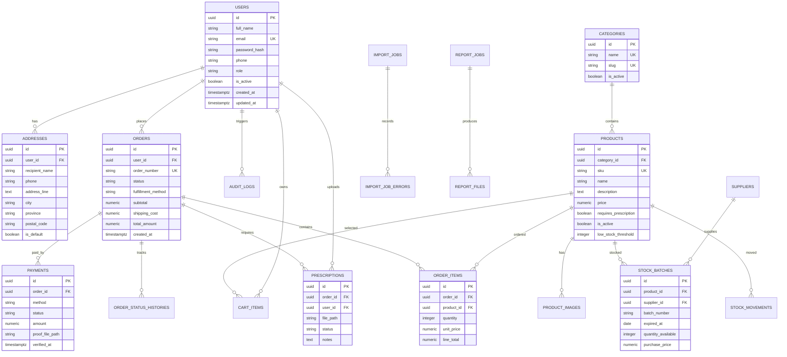

# Perancangan Sistem E-Commerce Penjualan Obat Klinik Makmur Jaya

## 1. Project Scope

### 1.1 Latar Belakang

Klinik Makmur Jaya membutuhkan sistem e-commerce untuk menjual obat dan produk kesehatan kepada pasien atau pelanggan secara lebih terstruktur. Sistem ini mendukung katalog obat, pemesanan online, validasi stok, pembayaran, pengiriman atau pengambilan di klinik, serta laporan operasional.

### 1.2 Tujuan Proyek

- Menyediakan platform penjualan obat berbasis web untuk pelanggan Klinik Makmur Jaya.
- Membantu admin, apoteker, dan manajemen mengelola produk, stok, pesanan, pembayaran, dan laporan.
- Mengurangi proses manual dalam pencatatan transaksi dan pengelolaan persediaan.
- Menyediakan data transaksi yang dapat digunakan untuk evaluasi penjualan dan pengambilan keputusan.

### 1.3 Ruang Lingkup Sistem

Sistem mencakup:

- Registrasi, login, dan manajemen akun pelanggan.
- Katalog obat dan produk kesehatan.
- Pencarian dan filter produk.
- Keranjang belanja.
- Checkout pesanan.
- Upload bukti pembayaran atau pencatatan status pembayaran.
- Manajemen pesanan oleh admin.
- Validasi dan pengurangan stok oleh apoteker/admin.
- Manajemen produk, kategori, supplier, stok, dan batch kedaluwarsa.
- Laporan penjualan, stok, produk terlaris, dan transaksi.
- Ekspor laporan PDF menggunakan ReportLab.
- Dashboard grafik menggunakan Recharts.
- Import data produk atau stok dari Excel menggunakan Pandas dan OpenPyXL.
- Pemrosesan tugas latar belakang menggunakan Celery dan Redis.

### 1.4 Batasan Sistem

- Sistem tidak menggantikan konsultasi dokter.
- Sistem tidak melakukan diagnosis penyakit.
- Pembayaran gateway pihak ketiga belum menjadi ruang lingkup utama; desain awal mendukung transfer manual atau status pembayaran yang diverifikasi admin.
- Obat yang membutuhkan resep harus melalui verifikasi resep sebelum pesanan diproses.
- Sistem dirancang sebagai aplikasi web, bukan aplikasi mobile native.

### 1.5 Stack Teknologi

| Layer | Teknologi |
| --- | --- |
| Frontend | React, Vite, Tailwind CSS |
| Backend | FastAPI |
| Database | PostgreSQL |
| ORM | SQLAlchemy |
| Migration | Alembic |
| Authentication | JWT, bcrypt |
| Report | ReportLab |
| Chart | Recharts |
| Import Excel | Pandas, OpenPyXL |
| Queue | Celery, Redis |

## 2. Functional Requirements

### 2.1 Autentikasi dan Otorisasi

| Kode | Kebutuhan |
| --- | --- |
| FR-001 | Pengguna dapat melakukan registrasi akun pelanggan. |
| FR-002 | Pengguna dapat login menggunakan email dan password. |
| FR-003 | Password disimpan dalam bentuk hash menggunakan bcrypt. |
| FR-004 | Sistem menerbitkan JWT access token setelah login berhasil. |
| FR-005 | Sistem membatasi akses fitur berdasarkan role pengguna. |
| FR-006 | Pengguna dapat logout dari aplikasi frontend. |
| FR-007 | Pengguna dapat memperbarui profil pribadi. |

### 2.2 Katalog Produk

| Kode | Kebutuhan |
| --- | --- |
| FR-008 | Pelanggan dapat melihat daftar obat dan produk kesehatan. |
| FR-009 | Pelanggan dapat melihat detail produk, harga, stok tersedia, kategori, dan informasi resep. |
| FR-010 | Pelanggan dapat mencari produk berdasarkan nama. |
| FR-011 | Pelanggan dapat memfilter produk berdasarkan kategori dan status ketersediaan. |
| FR-012 | Admin dapat membuat, mengubah, menonaktifkan, dan menghapus produk sesuai aturan bisnis. |

### 2.3 Keranjang dan Checkout

| Kode | Kebutuhan |
| --- | --- |
| FR-013 | Pelanggan dapat menambahkan produk ke keranjang. |
| FR-014 | Pelanggan dapat mengubah jumlah item di keranjang. |
| FR-015 | Sistem memvalidasi stok saat item ditambahkan dan saat checkout. |
| FR-016 | Pelanggan dapat memilih metode pemenuhan pesanan: ambil di klinik atau kirim. |
| FR-017 | Pelanggan dapat memasukkan alamat pengiriman. |
| FR-018 | Sistem menghitung subtotal, biaya pengiriman, diskon bila ada, dan total pesanan. |

### 2.4 Pesanan dan Pembayaran

| Kode | Kebutuhan |
| --- | --- |
| FR-019 | Pelanggan dapat membuat pesanan dari keranjang. |
| FR-020 | Pelanggan dapat melihat riwayat pesanan. |
| FR-021 | Pelanggan dapat melihat detail status pesanan. |
| FR-022 | Pelanggan dapat mengunggah bukti pembayaran. |
| FR-023 | Admin dapat memverifikasi pembayaran. |
| FR-024 | Admin/apoteker dapat memproses, menolak, atau menyelesaikan pesanan. |
| FR-025 | Sistem mencatat histori perubahan status pesanan. |

### 2.5 Resep dan Validasi Obat

| Kode | Kebutuhan |
| --- | --- |
| FR-026 | Produk dapat ditandai sebagai membutuhkan resep. |
| FR-027 | Pelanggan wajib mengunggah resep jika pesanan berisi obat wajib resep. |
| FR-028 | Apoteker dapat memverifikasi resep. |
| FR-029 | Pesanan obat wajib resep tidak dapat diproses sebelum resep disetujui. |

### 2.6 Manajemen Stok

| Kode | Kebutuhan |
| --- | --- |
| FR-030 | Admin/apoteker dapat melihat stok produk. |
| FR-031 | Admin/apoteker dapat menambah stok masuk. |
| FR-032 | Sistem mengurangi stok saat pesanan dikonfirmasi untuk diproses. |
| FR-033 | Sistem mencatat mutasi stok masuk, keluar, koreksi, dan pembatalan. |
| FR-034 | Sistem menyimpan informasi batch dan tanggal kedaluwarsa. |
| FR-035 | Sistem memberi indikator stok rendah dan produk mendekati kedaluwarsa. |

### 2.7 Import Data

| Kode | Kebutuhan |
| --- | --- |
| FR-036 | Admin dapat mengimpor data produk dari file Excel. |
| FR-037 | Admin dapat mengimpor data stok dari file Excel. |
| FR-038 | Sistem memvalidasi format file import. |
| FR-039 | Sistem mencatat hasil import, jumlah sukses, jumlah gagal, dan detail error. |
| FR-040 | Proses import besar dapat dijalankan sebagai background task menggunakan Celery. |

### 2.8 Laporan dan Dashboard

| Kode | Kebutuhan |
| --- | --- |
| FR-041 | Admin/manajemen dapat melihat dashboard ringkasan penjualan. |
| FR-042 | Admin/manajemen dapat melihat grafik penjualan menggunakan Recharts. |
| FR-043 | Admin/manajemen dapat mengekspor laporan penjualan PDF menggunakan ReportLab. |
| FR-044 | Admin/manajemen dapat melihat laporan stok. |
| FR-045 | Admin/manajemen dapat melihat laporan produk terlaris. |
| FR-046 | Admin/manajemen dapat memfilter laporan berdasarkan periode. |

### 2.9 Notifikasi Internal

| Kode | Kebutuhan |
| --- | --- |
| FR-047 | Sistem menampilkan notifikasi pesanan baru untuk admin/apoteker. |
| FR-048 | Sistem menampilkan notifikasi stok rendah. |
| FR-049 | Sistem menampilkan status tugas background seperti import dan generate report. |

## 3. Non Functional Requirements

| Kode | Kategori | Kebutuhan |
| --- | --- | --- |
| NFR-001 | Performance | Halaman katalog utama ditargetkan merespons kurang dari 3 detik pada koneksi stabil. |
| NFR-002 | Performance | API daftar produk menggunakan pagination untuk mencegah payload terlalu besar. |
| NFR-003 | Security | Password wajib di-hash dengan bcrypt. |
| NFR-004 | Security | API privat wajib menggunakan JWT dan role-based access control. |
| NFR-005 | Security | Input pengguna divalidasi di frontend dan backend. |
| NFR-006 | Security | File upload dibatasi tipe, ukuran, dan lokasi penyimpanan. |
| NFR-007 | Reliability | Transaksi checkout dan pengurangan stok harus atomik. |
| NFR-008 | Reliability | Background task harus memiliki status dan log error. |
| NFR-009 | Maintainability | Backend dipisahkan ke router, service, repository/model, schema, dan worker. |
| NFR-010 | Maintainability | Frontend dipisahkan ke pages, components, services, hooks, layouts, dan stores. |
| NFR-011 | Usability | UI harus responsif untuk desktop dan mobile browser. |
| NFR-012 | Auditability | Aktivitas penting seperti login gagal, update pesanan, verifikasi pembayaran, dan mutasi stok dicatat. |
| NFR-013 | Compatibility | Sistem berjalan di browser modern seperti Chrome, Edge, Firefox, dan Safari versi terbaru. |
| NFR-014 | Scalability | Arsitektur mendukung pemisahan web server, database, Redis, dan worker. |
| NFR-015 | Backup | Database harus dapat di-backup berkala dan dipulihkan saat dibutuhkan. |

## 4. User Roles

| Role | Deskripsi | Hak Akses Utama |
| --- | --- | --- |
| Guest | Pengunjung belum login. | Melihat katalog, mencari produk, registrasi, login. |
| Customer | Pelanggan terdaftar. | Mengelola profil, keranjang, checkout, upload resep, upload bukti pembayaran, melihat riwayat pesanan. |
| Pharmacist | Petugas apotek. | Verifikasi resep, validasi stok, memproses pesanan, mencatat mutasi stok. |
| Admin | Pengelola sistem operasional. | Mengelola produk, kategori, user, pesanan, pembayaran, stok, import data, laporan. |
| Manager | Pimpinan atau pemilik klinik. | Melihat dashboard dan laporan, memantau performa penjualan dan stok. |

## 5. Use Case List

| Kode | Use Case | Aktor | Ringkasan |
| --- | --- | --- | --- |
| UC-001 | Registrasi Akun | Guest | Guest membuat akun pelanggan baru. |
| UC-002 | Login | Guest, Customer, Pharmacist, Admin, Manager | Pengguna masuk ke sistem dan menerima token akses. |
| UC-003 | Melihat Katalog | Guest, Customer | Pengguna melihat daftar produk yang aktif dan tersedia. |
| UC-004 | Mencari Produk | Guest, Customer | Pengguna mencari produk berdasarkan kata kunci dan kategori. |
| UC-005 | Melihat Detail Produk | Guest, Customer | Pengguna melihat informasi lengkap produk. |
| UC-006 | Mengelola Keranjang | Customer | Customer menambah, mengubah, dan menghapus item keranjang. |
| UC-007 | Checkout Pesanan | Customer | Customer membuat pesanan dari isi keranjang. |
| UC-008 | Upload Resep | Customer | Customer mengunggah resep untuk obat tertentu. |
| UC-009 | Upload Bukti Pembayaran | Customer | Customer mengunggah bukti transfer. |
| UC-010 | Verifikasi Pembayaran | Admin | Admin memvalidasi bukti pembayaran. |
| UC-011 | Verifikasi Resep | Pharmacist | Apoteker menyetujui atau menolak resep. |
| UC-012 | Proses Pesanan | Admin, Pharmacist | Petugas mengubah status pesanan menjadi diproses, dikirim, siap diambil, atau selesai. |
| UC-013 | Kelola Produk | Admin | Admin membuat dan memperbarui data produk. |
| UC-014 | Kelola Kategori | Admin | Admin mengatur kategori produk. |
| UC-015 | Kelola Stok | Admin, Pharmacist | Petugas mencatat stok masuk, keluar, koreksi, dan batch. |
| UC-016 | Import Produk Excel | Admin | Admin mengunggah file Excel untuk membuat atau memperbarui produk. |
| UC-017 | Import Stok Excel | Admin | Admin mengunggah file Excel untuk memperbarui stok. |
| UC-018 | Lihat Dashboard | Admin, Manager | Pengguna melihat ringkasan metrik operasional. |
| UC-019 | Generate Laporan PDF | Admin, Manager | Pengguna membuat laporan PDF penjualan atau stok. |
| UC-020 | Kelola User | Admin | Admin mengatur status dan role user. |

## 6. ERD



## 7. Database Design

### 7.1 Prinsip Desain

- Menggunakan PostgreSQL sebagai database relasional utama.
- Menggunakan UUID sebagai primary key untuk entitas utama.
- Menggunakan constraint unique untuk email, SKU, slug kategori, dan nomor pesanan.
- Menggunakan timestamp `created_at` dan `updated_at` untuk audit dasar.
- Menggunakan transaksi database untuk checkout, verifikasi stok, dan mutasi stok.
- Menggunakan soft status seperti `is_active` untuk produk dan user agar histori transaksi tidak rusak.

### 7.2 Tabel Utama

#### users

| Kolom | Tipe | Constraint | Keterangan |
| --- | --- | --- | --- |
| id | UUID | PK | Identitas user. |
| full_name | VARCHAR(150) | NOT NULL | Nama lengkap. |
| email | VARCHAR(150) | UNIQUE, NOT NULL | Email login. |
| password_hash | VARCHAR(255) | NOT NULL | Hash bcrypt. |
| phone | VARCHAR(30) | NULL | Nomor telepon. |
| role | VARCHAR(30) | NOT NULL | guest tidak disimpan; nilai: customer, pharmacist, admin, manager. |
| is_active | BOOLEAN | DEFAULT TRUE | Status akun. |
| created_at | TIMESTAMPTZ | NOT NULL | Waktu dibuat. |
| updated_at | TIMESTAMPTZ | NOT NULL | Waktu diperbarui. |

#### categories

| Kolom | Tipe | Constraint | Keterangan |
| --- | --- | --- | --- |
| id | UUID | PK | Identitas kategori. |
| name | VARCHAR(100) | UNIQUE, NOT NULL | Nama kategori. |
| slug | VARCHAR(120) | UNIQUE, NOT NULL | Slug URL. |
| description | TEXT | NULL | Deskripsi kategori. |
| is_active | BOOLEAN | DEFAULT TRUE | Status kategori. |

#### products

| Kolom | Tipe | Constraint | Keterangan |
| --- | --- | --- | --- |
| id | UUID | PK | Identitas produk. |
| category_id | UUID | FK categories.id | Kategori produk. |
| sku | VARCHAR(80) | UNIQUE, NOT NULL | Kode produk. |
| name | VARCHAR(180) | NOT NULL | Nama obat/produk. |
| description | TEXT | NULL | Deskripsi produk. |
| price | NUMERIC(14,2) | NOT NULL | Harga jual. |
| unit | VARCHAR(50) | NOT NULL | Satuan, contoh strip, botol, tablet. |
| requires_prescription | BOOLEAN | DEFAULT FALSE | Penanda obat wajib resep. |
| low_stock_threshold | INTEGER | DEFAULT 10 | Batas stok rendah. |
| is_active | BOOLEAN | DEFAULT TRUE | Status produk. |

#### stock_batches

| Kolom | Tipe | Constraint | Keterangan |
| --- | --- | --- | --- |
| id | UUID | PK | Identitas batch. |
| product_id | UUID | FK products.id | Produk terkait. |
| supplier_id | UUID | FK suppliers.id, NULL | Supplier. |
| batch_number | VARCHAR(100) | NOT NULL | Nomor batch. |
| expired_at | DATE | NOT NULL | Tanggal kedaluwarsa. |
| quantity_available | INTEGER | NOT NULL | Stok tersedia per batch. |
| purchase_price | NUMERIC(14,2) | NULL | Harga beli. |
| received_at | DATE | NOT NULL | Tanggal diterima. |

#### stock_movements

| Kolom | Tipe | Constraint | Keterangan |
| --- | --- | --- | --- |
| id | UUID | PK | Identitas mutasi. |
| product_id | UUID | FK products.id | Produk terkait. |
| stock_batch_id | UUID | FK stock_batches.id, NULL | Batch terkait. |
| movement_type | VARCHAR(30) | NOT NULL | in, out, adjustment, return, cancel. |
| quantity | INTEGER | NOT NULL | Jumlah mutasi. |
| reference_type | VARCHAR(50) | NULL | order, import, manual. |
| reference_id | UUID | NULL | ID referensi. |
| notes | TEXT | NULL | Catatan. |
| created_by | UUID | FK users.id | User pembuat. |
| created_at | TIMESTAMPTZ | NOT NULL | Waktu dibuat. |

#### cart_items

| Kolom | Tipe | Constraint | Keterangan |
| --- | --- | --- | --- |
| id | UUID | PK | Identitas item keranjang. |
| user_id | UUID | FK users.id | Pemilik keranjang. |
| product_id | UUID | FK products.id | Produk. |
| quantity | INTEGER | NOT NULL | Jumlah. |
| created_at | TIMESTAMPTZ | NOT NULL | Waktu dibuat. |
| updated_at | TIMESTAMPTZ | NOT NULL | Waktu diperbarui. |

#### orders

| Kolom | Tipe | Constraint | Keterangan |
| --- | --- | --- | --- |
| id | UUID | PK | Identitas pesanan. |
| user_id | UUID | FK users.id | Customer. |
| order_number | VARCHAR(40) | UNIQUE, NOT NULL | Nomor pesanan. |
| status | VARCHAR(40) | NOT NULL | pending_payment, paid, prescription_review, processing, ready_for_pickup, shipped, completed, cancelled, rejected. |
| fulfillment_method | VARCHAR(30) | NOT NULL | pickup atau delivery. |
| shipping_address_snapshot | JSONB | NULL | Snapshot alamat saat checkout. |
| subtotal | NUMERIC(14,2) | NOT NULL | Subtotal. |
| shipping_cost | NUMERIC(14,2) | DEFAULT 0 | Ongkir. |
| total_amount | NUMERIC(14,2) | NOT NULL | Total. |
| notes | TEXT | NULL | Catatan pelanggan/admin. |
| created_at | TIMESTAMPTZ | NOT NULL | Waktu dibuat. |
| updated_at | TIMESTAMPTZ | NOT NULL | Waktu diperbarui. |

#### order_items

| Kolom | Tipe | Constraint | Keterangan |
| --- | --- | --- | --- |
| id | UUID | PK | Identitas item pesanan. |
| order_id | UUID | FK orders.id | Pesanan. |
| product_id | UUID | FK products.id | Produk. |
| product_name_snapshot | VARCHAR(180) | NOT NULL | Nama produk saat transaksi. |
| quantity | INTEGER | NOT NULL | Jumlah. |
| unit_price | NUMERIC(14,2) | NOT NULL | Harga satuan saat transaksi. |
| line_total | NUMERIC(14,2) | NOT NULL | Total baris. |

#### payments

| Kolom | Tipe | Constraint | Keterangan |
| --- | --- | --- | --- |
| id | UUID | PK | Identitas pembayaran. |
| order_id | UUID | FK orders.id | Pesanan. |
| method | VARCHAR(30) | NOT NULL | bank_transfer, cash_on_pickup. |
| status | VARCHAR(30) | NOT NULL | pending, uploaded, verified, rejected. |
| amount | NUMERIC(14,2) | NOT NULL | Nominal. |
| proof_file_path | VARCHAR(255) | NULL | Lokasi bukti bayar. |
| verified_by | UUID | FK users.id, NULL | Admin verifikator. |
| verified_at | TIMESTAMPTZ | NULL | Waktu verifikasi. |

#### prescriptions

| Kolom | Tipe | Constraint | Keterangan |
| --- | --- | --- | --- |
| id | UUID | PK | Identitas resep. |
| order_id | UUID | FK orders.id | Pesanan. |
| user_id | UUID | FK users.id | Pengunggah. |
| file_path | VARCHAR(255) | NOT NULL | Lokasi file resep. |
| status | VARCHAR(30) | NOT NULL | pending, approved, rejected. |
| reviewed_by | UUID | FK users.id, NULL | Apoteker pemeriksa. |
| reviewed_at | TIMESTAMPTZ | NULL | Waktu pemeriksaan. |
| notes | TEXT | NULL | Catatan pemeriksaan. |

#### import_jobs

| Kolom | Tipe | Constraint | Keterangan |
| --- | --- | --- | --- |
| id | UUID | PK | Identitas job. |
| job_type | VARCHAR(40) | NOT NULL | products atau stocks. |
| status | VARCHAR(30) | NOT NULL | queued, processing, success, partial_failed, failed. |
| original_file_name | VARCHAR(255) | NOT NULL | Nama file. |
| total_rows | INTEGER | DEFAULT 0 | Total baris. |
| success_rows | INTEGER | DEFAULT 0 | Baris sukses. |
| failed_rows | INTEGER | DEFAULT 0 | Baris gagal. |
| created_by | UUID | FK users.id | Admin. |
| created_at | TIMESTAMPTZ | NOT NULL | Waktu dibuat. |
| finished_at | TIMESTAMPTZ | NULL | Waktu selesai. |

#### report_jobs

| Kolom | Tipe | Constraint | Keterangan |
| --- | --- | --- | --- |
| id | UUID | PK | Identitas report job. |
| report_type | VARCHAR(50) | NOT NULL | sales, stock, best_selling. |
| status | VARCHAR(30) | NOT NULL | queued, processing, success, failed. |
| filter_params | JSONB | NULL | Filter laporan. |
| file_path | VARCHAR(255) | NULL | Lokasi PDF. |
| created_by | UUID | FK users.id | User pembuat. |
| created_at | TIMESTAMPTZ | NOT NULL | Waktu dibuat. |
| finished_at | TIMESTAMPTZ | NULL | Waktu selesai. |

### 7.3 Index yang Direkomendasikan

| Tabel | Index | Tujuan |
| --- | --- | --- |
| users | email | Login cepat dan unique constraint. |
| products | sku | Lookup produk internal. |
| products | name gin/trigram atau btree lower(name) | Pencarian produk. |
| products | category_id, is_active | Filter katalog. |
| stock_batches | product_id, expired_at | FEFO dan monitoring kedaluwarsa. |
| orders | user_id, created_at | Riwayat pesanan pelanggan. |
| orders | status, created_at | Dashboard operasional. |
| payments | order_id, status | Verifikasi pembayaran. |
| stock_movements | product_id, created_at | Kartu stok. |

## 8. API Design

### 8.1 Standar API

- Base path: `/api/v1`
- Format request/response: JSON, kecuali upload file menggunakan multipart form-data.
- Autentikasi: `Authorization: Bearer <access_token>`.
- Pagination: `page`, `page_size`, `total`, `items`.
- Format error:

```json
{
  "detail": "Pesan error",
  "code": "ERROR_CODE"
}
```

### 8.2 Endpoint Auth

| Method | Endpoint | Role | Deskripsi |
| --- | --- | --- | --- |
| POST | `/auth/register` | Public | Registrasi customer. |
| POST | `/auth/login` | Public | Login dan mendapatkan JWT. |
| GET | `/auth/me` | Authenticated | Mengambil profil user login. |
| PATCH | `/auth/me` | Authenticated | Update profil pribadi. |
| POST | `/auth/change-password` | Authenticated | Ganti password. |

### 8.3 Endpoint Produk dan Kategori

| Method | Endpoint | Role | Deskripsi |
| --- | --- | --- | --- |
| GET | `/categories` | Public | Daftar kategori aktif. |
| POST | `/categories` | Admin | Buat kategori. |
| PATCH | `/categories/{id}` | Admin | Update kategori. |
| GET | `/products` | Public | Daftar produk dengan filter dan pagination. |
| GET | `/products/{id}` | Public | Detail produk. |
| POST | `/products` | Admin | Buat produk. |
| PATCH | `/products/{id}` | Admin | Update produk. |
| DELETE | `/products/{id}` | Admin | Nonaktifkan produk. |
| POST | `/products/{id}/images` | Admin | Upload gambar produk. |

### 8.4 Endpoint Keranjang

| Method | Endpoint | Role | Deskripsi |
| --- | --- | --- | --- |
| GET | `/cart` | Customer | Lihat keranjang. |
| POST | `/cart/items` | Customer | Tambah item. |
| PATCH | `/cart/items/{id}` | Customer | Ubah jumlah. |
| DELETE | `/cart/items/{id}` | Customer | Hapus item. |
| DELETE | `/cart` | Customer | Kosongkan keranjang. |

### 8.5 Endpoint Pesanan

| Method | Endpoint | Role | Deskripsi |
| --- | --- | --- | --- |
| POST | `/orders/checkout` | Customer | Membuat pesanan dari keranjang. |
| GET | `/orders/my` | Customer | Riwayat pesanan pelanggan. |
| GET | `/orders/{id}` | Customer, Admin, Pharmacist, Manager | Detail pesanan sesuai akses. |
| GET | `/admin/orders` | Admin, Pharmacist | Daftar semua pesanan operasional. |
| PATCH | `/admin/orders/{id}/status` | Admin, Pharmacist | Update status pesanan. |
| POST | `/orders/{id}/cancel` | Customer, Admin | Batalkan pesanan sesuai aturan status. |

### 8.6 Endpoint Pembayaran dan Resep

| Method | Endpoint | Role | Deskripsi |
| --- | --- | --- | --- |
| POST | `/orders/{id}/payment-proof` | Customer | Upload bukti pembayaran. |
| PATCH | `/admin/payments/{id}/verify` | Admin | Verifikasi pembayaran. |
| PATCH | `/admin/payments/{id}/reject` | Admin | Tolak pembayaran. |
| POST | `/orders/{id}/prescriptions` | Customer | Upload resep. |
| PATCH | `/pharmacist/prescriptions/{id}/approve` | Pharmacist | Setujui resep. |
| PATCH | `/pharmacist/prescriptions/{id}/reject` | Pharmacist | Tolak resep. |

### 8.7 Endpoint Stok

| Method | Endpoint | Role | Deskripsi |
| --- | --- | --- | --- |
| GET | `/admin/stocks` | Admin, Pharmacist | Daftar stok per produk. |
| GET | `/admin/stocks/{product_id}/movements` | Admin, Pharmacist | Kartu stok produk. |
| POST | `/admin/stocks/batches` | Admin, Pharmacist | Tambah batch stok. |
| POST | `/admin/stocks/adjustments` | Admin, Pharmacist | Koreksi stok. |
| GET | `/admin/stocks/low-stock` | Admin, Pharmacist | Produk stok rendah. |
| GET | `/admin/stocks/near-expiry` | Admin, Pharmacist | Produk mendekati kedaluwarsa. |

### 8.8 Endpoint Import dan Report

| Method | Endpoint | Role | Deskripsi |
| --- | --- | --- | --- |
| POST | `/admin/imports/products` | Admin | Upload Excel produk. |
| POST | `/admin/imports/stocks` | Admin | Upload Excel stok. |
| GET | `/admin/imports/{id}` | Admin | Status import. |
| GET | `/admin/reports/sales` | Admin, Manager | Data laporan penjualan JSON. |
| GET | `/admin/reports/stocks` | Admin, Manager | Data laporan stok JSON. |
| POST | `/admin/reports/sales/pdf` | Admin, Manager | Membuat report PDF async. |
| GET | `/admin/reports/jobs/{id}` | Admin, Manager | Status report job. |
| GET | `/admin/reports/jobs/{id}/download` | Admin, Manager | Download PDF. |

### 8.9 Endpoint Dashboard

| Method | Endpoint | Role | Deskripsi |
| --- | --- | --- | --- |
| GET | `/admin/dashboard/summary` | Admin, Manager | Ringkasan omzet, order, stok rendah. |
| GET | `/admin/dashboard/sales-chart` | Admin, Manager | Data grafik penjualan untuk Recharts. |
| GET | `/admin/dashboard/best-selling-products` | Admin, Manager | Produk terlaris. |

## 9. Folder Structure Frontend

Target struktur frontend React + Vite + Tailwind CSS:

```text
frontend/
  index.html
  package.json
  vite.config.js
  tailwind.config.js
  postcss.config.js
  src/
    main.jsx
    App.jsx
    assets/
      images/
      icons/
    components/
      common/
        Button.jsx
        Input.jsx
        Modal.jsx
        Pagination.jsx
        ProtectedRoute.jsx
      layout/
        PublicLayout.jsx
        CustomerLayout.jsx
        AdminLayout.jsx
        Sidebar.jsx
        Navbar.jsx
      product/
        ProductCard.jsx
        ProductFilter.jsx
      order/
        OrderStatusBadge.jsx
        OrderTimeline.jsx
      dashboard/
        SalesChart.jsx
        SummaryCard.jsx
    pages/
      public/
        HomePage.jsx
        ProductListPage.jsx
        ProductDetailPage.jsx
      auth/
        LoginPage.jsx
        RegisterPage.jsx
      customer/
        CartPage.jsx
        CheckoutPage.jsx
        MyOrdersPage.jsx
        OrderDetailPage.jsx
        ProfilePage.jsx
      admin/
        DashboardPage.jsx
        ProductManagementPage.jsx
        CategoryManagementPage.jsx
        OrderManagementPage.jsx
        StockManagementPage.jsx
        ImportPage.jsx
        ReportPage.jsx
        UserManagementPage.jsx
      pharmacist/
        PrescriptionReviewPage.jsx
        StockReviewPage.jsx
    services/
      apiClient.js
      authService.js
      productService.js
      cartService.js
      orderService.js
      stockService.js
      reportService.js
      importService.js
    hooks/
      useAuth.js
      usePagination.js
      useDebounce.js
    stores/
      authStore.js
      cartStore.js
    routes/
      router.jsx
      routeConfig.js
    utils/
      formatCurrency.js
      formatDate.js
      validators.js
    styles/
      index.css
```

## 10. Folder Structure Backend

Target struktur backend FastAPI + SQLAlchemy + Alembic + Celery:

```text
backend/
  pyproject.toml
  alembic.ini
  .env.example
  app/
    main.py
    core/
      config.py
      security.py
      jwt.py
      permissions.py
      logging.py
    db/
      session.py
      base.py
      init_db.py
    models/
      user.py
      address.py
      category.py
      product.py
      stock.py
      cart.py
      order.py
      payment.py
      prescription.py
      import_job.py
      report_job.py
      audit_log.py
    schemas/
      auth.py
      user.py
      product.py
      cart.py
      order.py
      payment.py
      prescription.py
      stock.py
      import_job.py
      report.py
      common.py
    api/
      deps.py
      v1/
        router.py
        endpoints/
          auth.py
          categories.py
          products.py
          cart.py
          orders.py
          payments.py
          prescriptions.py
          stocks.py
          imports.py
          reports.py
          dashboard.py
          users.py
    services/
      auth_service.py
      product_service.py
      cart_service.py
      order_service.py
      payment_service.py
      prescription_service.py
      stock_service.py
      import_service.py
      report_service.py
      dashboard_service.py
    repositories/
      user_repository.py
      product_repository.py
      order_repository.py
      stock_repository.py
    workers/
      celery_app.py
      tasks/
        import_tasks.py
        report_tasks.py
        notification_tasks.py
    reports/
      sales_report.py
      stock_report.py
    imports/
      product_importer.py
      stock_importer.py
      templates/
        product_import_template.xlsx
        stock_import_template.xlsx
    storage/
      files.py
    utils/
      pagination.py
      datetime.py
      money.py
  alembic/
    env.py
    script.py.mako
    versions/
  tests/
    unit/
    integration/
```

## 11. Security Architecture

### 11.1 Autentikasi

- Login menggunakan email dan password.
- Password di-hash menggunakan bcrypt sebelum disimpan.
- Backend menerbitkan JWT access token berisi `sub`, `role`, `iat`, dan `exp`.
- Token dikirim melalui header `Authorization: Bearer <token>`.
- Masa berlaku token dibuat terbatas untuk mengurangi risiko penyalahgunaan.

### 11.2 Otorisasi

- Setiap endpoint privat menggunakan dependency FastAPI untuk mengambil user aktif dari JWT.
- Role-based access control diterapkan pada endpoint admin, apoteker, manager, dan customer.
- Customer hanya dapat mengakses resource miliknya sendiri, seperti keranjang, alamat, dan pesanan pribadi.
- Admin dapat mengelola data master dan operasional.
- Manager hanya melihat data laporan dan dashboard, tidak mengubah transaksi.

### 11.3 Proteksi Data

- Data sensitif seperti password tidak pernah dikembalikan di response API.
- Bukti pembayaran dan resep disimpan sebagai file dengan path internal, bukan path publik langsung.
- File upload divalidasi berdasarkan MIME type, ekstensi, dan ukuran.
- Nama file upload dinormalisasi agar tidak menggunakan input mentah dari user.
- Snapshot harga, nama produk, dan alamat disimpan pada order untuk menjaga histori transaksi.

### 11.4 Proteksi Aplikasi

- Validasi input menggunakan schema Pydantic.
- Query database menggunakan SQLAlchemy ORM untuk menurunkan risiko SQL injection.
- CORS dibatasi pada domain frontend yang diizinkan.
- Rate limit direkomendasikan untuk login, upload, dan endpoint sensitif.
- Audit log dicatat untuk aktivitas penting.
- Environment variable digunakan untuk secret seperti JWT secret, database URL, dan konfigurasi Redis.

### 11.5 Audit dan Monitoring

Aktivitas yang perlu diaudit:

- Login berhasil dan gagal.
- Perubahan role atau status user.
- Create/update/delete produk.
- Verifikasi pembayaran.
- Verifikasi resep.
- Perubahan status pesanan.
- Mutasi stok.
- Import data.
- Generate laporan.

## 12. Hardware Architecture

### 12.1 Arsitektur Minimal untuk Pengembangan dan Demo

```text
User Browser
    |
    v
React Vite Frontend
    |
    v
FastAPI Backend
    |
    +--> PostgreSQL
    +--> Redis
    +--> Celery Worker
    +--> File Storage Lokal
```

Spesifikasi minimal:

| Komponen | Spesifikasi Minimal |
| --- | --- |
| Server aplikasi | 2 CPU core, 4 GB RAM |
| Database | PostgreSQL lokal atau container, 2 GB RAM dialokasikan |
| Redis | 512 MB RAM |
| Storage | 20 GB untuk database, upload, dan report |
| Client | Browser modern dengan koneksi internet/intranet |

### 12.2 Arsitektur Produksi yang Direkomendasikan

```text
Client Browser
    |
    v
Reverse Proxy / Load Balancer
    |
    +--> Frontend Static Hosting
    |
    +--> FastAPI App Server
            |
            +--> PostgreSQL Server
            +--> Redis Server
            +--> Celery Worker Server
            +--> Object/File Storage
```

Spesifikasi awal produksi:

| Komponen | Rekomendasi Awal |
| --- | --- |
| App server | 2-4 CPU core, 4-8 GB RAM |
| Database server | 2-4 CPU core, 8 GB RAM, SSD |
| Worker server | 2 CPU core, 4 GB RAM |
| Redis | 1-2 GB RAM |
| Backup storage | Minimal 2x ukuran database aktif |
| Network | HTTPS, firewall, akses DB hanya dari backend |

## 13. Scalability Analysis

### 13.1 Potensi Beban Sistem

| Area | Potensi Beban | Strategi |
| --- | --- | --- |
| Katalog produk | Banyak user membaca daftar produk | Pagination, index produk, cache kategori. |
| Checkout | Perlu konsistensi stok | Database transaction dan row-level locking pada batch stok. |
| Upload file | Resep dan bukti pembayaran bertambah | Validasi ukuran, storage terpisah, retensi file. |
| Import Excel | File besar memblokir request | Celery task async. |
| Report PDF | Generate laporan berat | Celery task async dan penyimpanan hasil PDF. |
| Dashboard | Query agregasi berat | Index tanggal/status, materialized view bila data membesar. |

### 13.2 Skalabilitas Horizontal

- FastAPI app server dapat diperbanyak di belakang load balancer.
- Celery worker dapat diperbanyak sesuai antrian tugas.
- Redis digunakan sebagai broker task queue.
- Frontend React dapat disajikan sebagai static asset melalui CDN atau static hosting.

### 13.3 Skalabilitas Database

- Gunakan index untuk kolom filter utama.
- Gunakan connection pooling.
- Pisahkan query laporan berat dari transaksi utama bila volume meningkat.
- Pertimbangkan read replica untuk dashboard dan laporan jika data transaksi besar.
- Gunakan partitioning tabel besar seperti `stock_movements` dan `audit_logs` bila volume sangat tinggi.

### 13.4 Bottleneck yang Perlu Diantisipasi

- Checkout serentak pada produk stok terbatas.
- Query laporan tanpa filter periode.
- Upload file terlalu besar.
- Worker tunggal saat banyak import dan report berjalan bersamaan.
- Database storage membesar karena audit log dan file metadata.

## 14. Risk Analysis

| Risiko | Dampak | Probabilitas | Mitigasi |
| --- | --- | --- | --- |
| Stok tidak akurat saat checkout bersamaan | Tinggi | Sedang | Gunakan transaksi database dan locking pada batch stok. |
| Pesanan obat resep diproses tanpa validasi | Tinggi | Rendah-Sedang | Wajibkan status resep approved sebelum status processing. |
| Password bocor | Tinggi | Rendah | bcrypt, secret management, tidak log password. |
| Upload file berbahaya | Tinggi | Sedang | Validasi MIME, ekstensi, ukuran, random filename, simpan di folder non-eksekusi. |
| Import Excel merusak data produk | Sedang-Tinggi | Sedang | Validasi template, preview error, transaksi per baris atau batch aman, log import. |
| Laporan lambat saat data besar | Sedang | Sedang | Filter periode, index, Celery async, agregasi. |
| Redis down | Sedang | Rendah | Tugas async tertunda; aplikasi utama tetap berjalan untuk transaksi inti. |
| Database down | Tinggi | Rendah | Backup, monitoring, restart policy, recovery plan. |
| Kesalahan role user | Tinggi | Rendah | RBAC terpusat dan audit perubahan role. |
| Bukti pembayaran palsu | Sedang | Sedang | Verifikasi manual admin dan pencatatan status. |
| Data pribadi pelanggan terekspos | Tinggi | Rendah | Authorization resource ownership, HTTPS, audit log. |
| Perubahan kebutuhan saat sertifikasi | Sedang | Sedang | Dokumentasi scope, modular design, prioritas MVP. |

## 15. UAT Plan

### 15.1 Tujuan UAT

Memastikan sistem memenuhi kebutuhan pengguna Klinik Makmur Jaya dan siap digunakan untuk proses penjualan obat secara online sesuai ruang lingkup proyek.

### 15.2 Peserta UAT

| Peserta | Fokus Pengujian |
| --- | --- |
| Customer perwakilan | Registrasi, katalog, keranjang, checkout, upload resep/bukti bayar. |
| Admin | Produk, kategori, user, pesanan, pembayaran, import, laporan. |
| Apoteker | Verifikasi resep, proses pesanan, stok. |
| Manager | Dashboard dan laporan. |

### 15.3 Skenario UAT

| Kode | Skenario | Langkah Utama | Expected Result |
| --- | --- | --- | --- |
| UAT-001 | Registrasi pelanggan | Isi form registrasi valid | Akun customer dibuat dan dapat login. |
| UAT-002 | Login user | Masukkan email dan password benar | User masuk sesuai role. |
| UAT-003 | Cari produk | Cari nama produk di katalog | Produk relevan tampil. |
| UAT-004 | Tambah keranjang | Pilih produk dan jumlah | Item masuk ke keranjang. |
| UAT-005 | Checkout non-resep | Checkout produk biasa | Pesanan dibuat dengan status pending_payment. |
| UAT-006 | Checkout obat resep | Checkout produk wajib resep | Sistem meminta upload resep. |
| UAT-007 | Upload resep | Upload file resep valid | Resep tersimpan dengan status pending. |
| UAT-008 | Verifikasi resep | Apoteker approve resep | Status resep approved dan pesanan dapat diproses. |
| UAT-009 | Upload bukti bayar | Customer upload bukti transfer | Payment menjadi uploaded. |
| UAT-010 | Verifikasi pembayaran | Admin approve bukti bayar | Payment verified dan status order lanjut sesuai aturan. |
| UAT-011 | Proses pesanan | Admin/apoteker ubah status | Histori status tercatat. |
| UAT-012 | Stok berkurang | Pesanan diproses | Stok produk berkurang dan mutasi tercatat. |
| UAT-013 | Import produk | Upload template Excel valid | Produk berhasil diimpor dan job sukses. |
| UAT-014 | Import gagal sebagian | Upload Excel dengan beberapa baris invalid | Sistem menampilkan jumlah gagal dan detail error. |
| UAT-015 | Dashboard | Manager buka dashboard | Metrik dan grafik tampil sesuai data. |
| UAT-016 | Generate laporan PDF | Pilih periode dan generate | PDF dibuat dan dapat diunduh. |
| UAT-017 | Role restriction | Customer akses halaman admin | Akses ditolak. |

### 15.4 Kriteria Penerimaan

- Semua skenario prioritas tinggi lulus.
- Tidak ada bug kritikal pada checkout, pembayaran, resep, dan stok.
- Hak akses role berjalan sesuai desain.
- Laporan utama dapat dihasilkan.
- Import data memiliki validasi dan log hasil.

## 16. Cutover Plan

### 16.1 Strategi Cutover

Strategi yang direkomendasikan adalah phased cutover:

1. Persiapan data master produk, kategori, supplier, dan stok awal.
2. Uji sistem di lingkungan staging/demo.
3. Training singkat admin, apoteker, dan manager.
4. Go-live terbatas untuk pesanan internal atau pelanggan tertentu.
5. Evaluasi hasil go-live terbatas.
6. Go-live penuh untuk seluruh pelanggan.

### 16.2 Tahapan Cutover

| Tahap | Aktivitas | PIC |
| --- | --- | --- |
| H-7 | Finalisasi data produk, kategori, harga, dan stok | Admin, Apoteker |
| H-5 | Import data master ke staging | Admin |
| H-4 | UAT final dan perbaikan minor | Tim proyek |
| H-3 | Backup data manual lama | Admin |
| H-2 | Training pengguna internal | Tim proyek |
| H-1 | Freeze perubahan data master manual | Admin |
| H | Deploy produksi dan import stok final | Tim proyek, Admin |
| H+1 | Monitoring transaksi awal | Admin, Apoteker |
| H+7 | Evaluasi stabilitas dan laporan awal | Manager |

### 16.3 Data Migration

- Produk dan kategori dimigrasikan menggunakan template Excel.
- Stok awal dimigrasikan menggunakan template Excel stok.
- User internal dibuat oleh admin.
- Customer lama dapat dibuat melalui registrasi mandiri atau import bila data tersedia dan sesuai persetujuan.

### 16.4 Rollback Plan

- Simpan backup database sebelum go-live.
- Simpan file Excel sumber import.
- Jika terjadi gangguan kritikal pada hari go-live, proses transaksi kembali dilakukan manual sementara.
- Pesanan yang sudah masuk diekspor atau dicatat sebelum rollback operasional.
- Setelah perbaikan, data transaksi manual selama downtime dimasukkan kembali melalui prosedur admin.

## 17. Impact Analysis

### 17.1 Dampak Operasional

| Area | Dampak Positif | Dampak yang Perlu Dikelola |
| --- | --- | --- |
| Penjualan | Pelanggan dapat memesan obat tanpa datang langsung terlebih dahulu. | Staf perlu memantau pesanan online secara rutin. |
| Apotek | Stok dan mutasi lebih tercatat. | Apoteker perlu disiplin memproses validasi resep dan stok. |
| Admin | Data produk, pembayaran, dan laporan lebih terpusat. | Admin perlu belajar alur import, verifikasi, dan koreksi data. |
| Manajemen | Laporan lebih cepat tersedia. | Perlu memastikan data transaksi valid agar laporan akurat. |
| Pelanggan | Proses pembelian lebih mudah dan transparan. | Pelanggan perlu memahami aturan obat resep dan pembayaran. |

### 17.2 Dampak Data

- Data produk menjadi terstandarisasi berdasarkan SKU, kategori, satuan, dan harga.
- Histori transaksi tersimpan dan dapat diaudit.
- Stok perlu dijaga konsisten antara sistem dan kondisi fisik.
- Data pribadi pelanggan harus dilindungi melalui akses terbatas dan kebijakan keamanan.

### 17.3 Dampak Proses Bisnis

Proses lama:

```text
Pelanggan datang/menghubungi klinik -> Staf cek stok manual -> Pembayaran -> Obat diberikan -> Catatan manual
```

Proses baru:

```text
Pelanggan pesan online -> Sistem validasi keranjang -> Pembayaran/resep diverifikasi -> Stok diproses -> Pesanan dikirim/diambil -> Laporan otomatis
```

### 17.4 Dampak Teknologi

- Klinik membutuhkan server atau hosting untuk backend, frontend, database, Redis, worker, dan storage.
- Perlu mekanisme backup database dan file upload.
- Perlu monitoring service agar gangguan dapat diketahui lebih cepat.
- Perlu dokumentasi operasional untuk admin dan apoteker.

### 17.5 Dampak Risiko dan Kontrol

| Dampak | Kontrol |
| --- | --- |
| Salah input stok | Mutasi stok, audit log, dan koreksi stok terotorisasi. |
| Salah proses obat resep | Validasi resep wajib sebelum order diproses. |
| Pembayaran belum valid | Status payment wajib verified sebelum pesanan selesai. |
| Akses tidak sah | JWT, bcrypt, RBAC, dan pembatasan resource ownership. |
| Kehilangan data | Backup berkala dan rollback plan. |

## Lampiran A. Status Lifecycle

### Order Status

| Status | Keterangan |
| --- | --- |
| pending_payment | Pesanan dibuat dan menunggu pembayaran. |
| waiting_prescription | Pesanan membutuhkan resep dan menunggu upload/verifikasi. |
| prescription_review | Resep sedang diperiksa apoteker. |
| paid | Pembayaran sudah diverifikasi. |
| processing | Pesanan sedang disiapkan. |
| ready_for_pickup | Pesanan siap diambil di klinik. |
| shipped | Pesanan dikirim. |
| completed | Pesanan selesai. |
| cancelled | Pesanan dibatalkan. |
| rejected | Pesanan ditolak karena alasan valid, misalnya resep tidak sesuai. |

### Payment Status

| Status | Keterangan |
| --- | --- |
| pending | Belum ada bukti pembayaran. |
| uploaded | Bukti pembayaran telah diunggah. |
| verified | Pembayaran disetujui admin. |
| rejected | Bukti pembayaran ditolak. |

### Prescription Status

| Status | Keterangan |
| --- | --- |
| pending | Resep belum diperiksa. |
| approved | Resep disetujui apoteker. |
| rejected | Resep ditolak apoteker. |

## Lampiran B. Prioritas MVP

### Prioritas 1

- Auth dan role.
- Katalog produk.
- Keranjang dan checkout.
- Upload resep dan bukti pembayaran.
- Verifikasi resep dan pembayaran.
- Manajemen produk dan stok.
- Laporan penjualan dasar.

### Prioritas 2

- Import Excel.
- Dashboard grafik.
- Generate PDF async.
- Audit log lengkap.
- Monitoring stok rendah dan kedaluwarsa.

### Prioritas 3

- Integrasi payment gateway.
- Notifikasi email/WhatsApp.
- Loyalty point atau promo.
- Read replica/reporting database jika dibutuhkan.
