# Use Case Diagram - Klinik Makmur Jaya

```mermaid
flowchart LR
    Admin([Admin])
    Apoteker([Apoteker])
    Kasir([Kasir])
    Pasien([Pasien])

    subgraph System["Sistem E-Commerce Obat Klinik Makmur Jaya"]
        UCLogin((Login))
        UCLogout((Logout))
        UCRefresh((Refresh Token))
        UCVerifyEmail((Verifikasi Email))

        UCDashboardAdmin((Lihat Dashboard Admin))
        UCDashboardApoteker((Lihat Dashboard Apoteker))
        UCDashboardKasir((Lihat Dashboard Kasir))
        UCDashboardPasien((Lihat Dashboard Pasien))

        UCKelolaObat((Kelola Obat))
        UCKelolaKategori((Kelola Kategori))
        UCKelolaSupplier((Kelola Supplier))
        UCUploadGambarObat((Upload Gambar Obat))
        UCImportObat((Import Data Obat))

        UCLihatKatalog((Lihat Katalog Obat))
        UCCariObat((Cari Obat))
        UCLihatDetailObat((Lihat Detail Obat))

        UCKelolaStok((Kelola Stok))
        UCTambahBatch((Tambah Batch Stok))
        UCAdjustmentStok((Adjustment Stok))
        UCLihatStokKritis((Lihat Stok Kritis))
        UCLihatExpired((Lihat Obat Mendekati Kadaluarsa))

        UCUploadResep((Upload Resep))
        UCVerifikasiResep((Verifikasi Resep))
        UCApproveResep((Setujui Resep))
        UCRejectResep((Tolak Resep))

        UCKelolaCart((Kelola Keranjang))
        UCTambahCart((Tambah Item Keranjang))
        UCUpdateCart((Update Qty Keranjang))
        UCHapusCart((Hapus Item Keranjang))
        UCCheckoutOnline((Checkout Online))
        UCUploadBuktiBayar((Upload Bukti Pembayaran))
        UCLihatPesanan((Lihat Pesanan))
        UCLihatDetailPesanan((Lihat Detail Pesanan))

        UCCartKasir((Buat Cart Kasir))
        UCCheckoutKasir((Checkout Kasir))
        UCLihatTransaksi((Lihat Transaksi))

        UCLaporan((Lihat Laporan))
        UCSalesReport((Laporan Penjualan))
        UCRevenueReport((Laporan Revenue))
        UCBestSelling((Laporan Obat Terlaris))
        UCGeneratePdf((Generate PDF Laporan))

        UCNotifikasi((Lihat Notifikasi))
        UCTandaiNotifikasi((Tandai Notifikasi Dibaca))
        UCAuditLog((Lihat Audit Log))
        UCErrorLog((Kelola Error Log))
        UCMonitoring((Monitoring Backend))
    end

    Admin --> UCLogin
    Apoteker --> UCLogin
    Kasir --> UCLogin
    Pasien --> UCLogin
    Pasien --> UCVerifyEmail

    Admin --> UCLogout
    Apoteker --> UCLogout
    Kasir --> UCLogout
    Pasien --> UCLogout

    Admin --> UCRefresh
    Apoteker --> UCRefresh
    Kasir --> UCRefresh
    Pasien --> UCRefresh

    Admin --> UCDashboardAdmin
    Apoteker --> UCDashboardApoteker
    Kasir --> UCDashboardKasir
    Pasien --> UCDashboardPasien

    Admin --> UCKelolaObat
    Admin --> UCKelolaKategori
    Admin --> UCKelolaSupplier
    Admin --> UCUploadGambarObat
    Admin --> UCImportObat

    Admin --> UCKelolaStok
    Apoteker --> UCKelolaStok
    Kasir --> UCLihatStokKritis

    UCKelolaStok --> UCTambahBatch
    UCKelolaStok --> UCAdjustmentStok
    UCKelolaStok --> UCLihatStokKritis
    UCKelolaStok --> UCLihatExpired

    Pasien --> UCLihatKatalog
    Kasir --> UCLihatKatalog
    UCLihatKatalog --> UCCariObat
    UCLihatKatalog --> UCLihatDetailObat

    Pasien --> UCKelolaCart
    UCKelolaCart --> UCTambahCart
    UCKelolaCart --> UCUpdateCart
    UCKelolaCart --> UCHapusCart
    Pasien --> UCCheckoutOnline
    Pasien --> UCUploadResep
    Pasien --> UCUploadBuktiBayar
    Pasien --> UCLihatPesanan
    UCLihatPesanan --> UCLihatDetailPesanan

    Admin --> UCVerifikasiResep
    Apoteker --> UCVerifikasiResep
    UCVerifikasiResep --> UCApproveResep
    UCVerifikasiResep --> UCRejectResep

    Kasir --> UCCartKasir
    Kasir --> UCCheckoutKasir
    Kasir --> UCLihatTransaksi
    Admin --> UCLihatTransaksi

    Admin --> UCLaporan
    Kasir --> UCLaporan
    UCLaporan --> UCSalesReport
    UCLaporan --> UCRevenueReport
    UCLaporan --> UCBestSelling
    UCLaporan --> UCGeneratePdf

    Admin --> UCNotifikasi
    Kasir --> UCNotifikasi
    Pasien --> UCNotifikasi
    UCNotifikasi --> UCTandaiNotifikasi

    Admin --> UCAuditLog
    Admin --> UCErrorLog
    Admin --> UCMonitoring
```

## Ringkasan Aktor

| Aktor | Use case utama |
| --- | --- |
| Admin | Dashboard, kelola obat, kategori, supplier, stok, resep, transaksi, laporan, audit log, error log, monitoring, notifikasi |
| Apoteker | Dashboard, verifikasi resep, kelola stok, stok kritis, obat mendekati kadaluarsa |
| Kasir | Dashboard, katalog obat, stok kritis, cart kasir, checkout kasir, transaksi, laporan, notifikasi |
| Pasien | Register/verifikasi email, katalog obat, keranjang, checkout online, upload resep, upload bukti bayar, pesanan, notifikasi |
